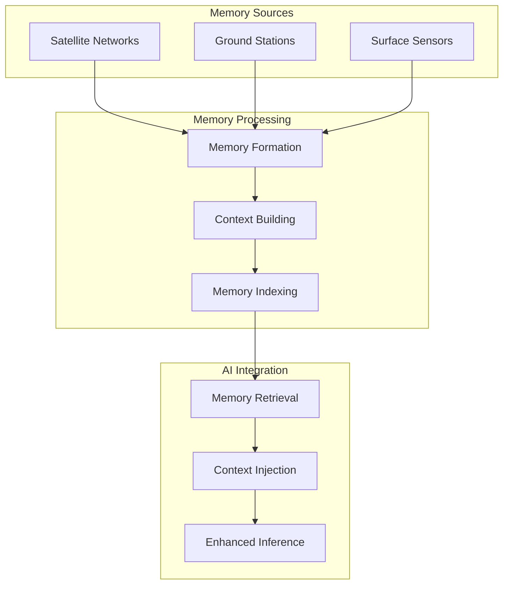

<div align="center">

# memories.dev

**Contextual Memory Infrastructure for AI Systems**

[](https://docs.memories.dev)
[](LICENSE)
[](https://www.python.org/downloads/)
[](https://github.com/psf/black)

</div>

## Overview

memories.dev is a high-performance infrastructure for providing real-world context to AI models during inference. It processes, indexes, and serves location-tagged intelligence ("memories") from multiple data sources including satellite imagery, climate sensors, and urban development metrics. These memories enhance AI models' understanding and reasoning capabilities with real-world context.

## Core Features

### Memory Sources
- Global Points of Interest Database
- Global Places Database
- Cadastral Data & Digital Elevation Models
- Census & Demographics
- Satellite Data:
  - ESA Sentinel-1 & 2
  - NASA Landsat 7/8
  - Custom data source integration

### Key Capabilities
- Real-time memory retrieval during model inference
- Context-aware AI reasoning
- Multi-modal memory fusion
- Temporal pattern analysis
- Location-aware intelligence
- Privacy-preserving memory access

## System Architecture



## Quick Start

```python
from memories_dev import MemoriesClient
from memories_dev.store import MemoryStore
from memories_dev.inference import ModelContext

# Initialize client
client = MemoriesClient(api_key="your_key")

# Create memory store
store = MemoryStore()

# Query contextual memories
memories = store.query(
    location=(37.7749, -122.4194),
    radius="10km",
    time_range=("2023-01-01", "2024-01-01"),
    memory_types=["satellite", "poi", "climate"]
)

# Enhance model inference with memories
context = ModelContext(memories=memories)
response = client.inference(
    query="Analyze urban development impact on local climate",
    context=context,
    model="gpt-4",  # or any supported model
    response_format="report"
)
```

## Installation

```bash
# Basic installation
pip install memories-dev

# With GPU support
pip install memories-dev[gpu]
```

## System Requirements

### Minimum
- Python 3.9+
- 16GB RAM
- 4+ CPU cores
- 20GB storage

### Recommended
- 32GB RAM
- 8+ CPU cores
- NVIDIA GPU (8GB+ VRAM)
- 50GB SSD storage

## Use Cases

- **Enhanced Language Models**: Provide real-world context during inference
- **Report Generation**: Create detailed reports with location-specific insights
- **Trend Analysis**: Analyze temporal patterns with historical context
- **Impact Assessment**: Evaluate environmental and urban development impacts
- **Decision Support**: Aid decision-making with contextual intelligence

## Documentation

Visit [docs.memories.dev](https://docs.memories.dev) for:
- API Reference
- Integration Guides
- Memory System Architecture
- Model Integration Examples
- Performance Tuning
- Best Practices

## Contributing

We welcome contributions! See our [Contributing Guide](CONTRIBUTING.md) for:
- Development Setup
- Code Style Guidelines
- Testing Requirements
- PR Process

## Support

- [GitHub Issues](https://github.com/memories-dev/memories.dev/issues)
- [Discord Community](https://discord.gg/memories-dev)
- [Documentation](https://docs.memories.dev)
- Email: support@memories.dev

## License

Apache License 2.0 - See [LICENSE](LICENSE) for details.

---

<div align="center">
<p>Empowering AI with Real-World Context</p>
</div>
