<div align="center">


**Version: 2025.1** | **LIVE Demo : https://app.vortx.ai ** | **Build: 2025.1.1-stable**

[](https://docs.synthetic-satellite.ai)
[](LICENSE)
[](https://www.python.org/downloads/)
[](https://github.com/psf/black)

*Synthetic Satellite generate Earth Memories, enabling Real World thinking, reasoning & synthesis capabilities in AI, Agents and robots.*

</div>


## 🌍 What are Memories?

Earth memories are comprehensive, living records of our planet's patterns, behaviors, and changes. Think of them as the planet's own diary, constantly being written and updated in real-time. These memories capture everything from weather patterns and urban development to market trends and human activities.

Datasets embedded as memories :
1. Global PoI Database.
2. Global Places Database.
3. Global Cadastre, DEM, High-Res.
4. Census, News and Human sources.
   

Datasets embedded as runtime synthetic-satellite :
1. ESA's Sentinel-2.
2. ESA's Sentinel-1.
3. NASA's landsat-7,8.
During deployment add in custom synthetic-satellite sources, supports raster, vector, media.

Core Capabilities
1. Earth Memory Formation
Real-time Processing: Continuous ingestion and processing of global data
Multi-modal Integration: Combining satellite, IoT, and ground-based data
Adaptive Learning: Self-improving memory formation systems
Context Preservation: Maintaining relationships between different data points
2. AGI Integration
SOTA Integration: Advanced language and vision models including Deepseek.
Memory-Based Learning: Continuous learning from Earth memories
Pattern Recognition: Advanced pattern detection and analysis
Predictive Capabilities: Future scenario modeling and prediction
Autonomous Reasoning: Self-directed learning and analysis


## Overview

Vortx is a cutting-edge Earth Memory System designed for AGI and advanced geospatial analysis. It combines state-of-the-art ML models (including DeepSeek-R1/V3 and other SOTA models) with synthetic data generation to create rich, contextual memories of Earth observations. Key capabilities include:

- 🧠 **AGI Memory Formation**: Create and retrieve complex Earth memories for AGI systems
- 🌍 **Earth Memory Retractor**: Link Earth data at scale 
- 🤖 **Model Deployments**: Integrated DeepSeek-R1/V3 and other SOTA models for superior understanding
- 🎯 **Synthetic Data**: Generate high-quality synthetic data for training and simulation
- ⚡ **High Performance**: GPU-accelerated processing with distributed computing
- 🔒 **Privacy**: Advanced privacy-preserving techniques for sensitive data

## System Architecture

The system creates a living memory of Earth's state across seven observational levels, each contributing to a holistic understanding:

```mermaid
graph TD
    classDef inputNode fill:#e1f5fe,stroke:#01579b,stroke-width:2px;
    classDef processingNode fill:#f3e5f5,stroke:#4a148c,stroke-width:2px;
    classDef outputNode fill:#e8f5e9,stroke:#1b5e20,stroke-width:2px;
    classDef aiNode fill:#fff3e0,stroke:#e65100,stroke-width:2px;

    subgraph "Input Sources"
        L1["🛰️ Satellite Networks"]
        L2["✈️ Aerial Systems"]
        L3["🏢 Ground Stations"]
        L4["📡 Surface Sensors"]
        L5["⚡ Subsurface Networks"]
        L6["🔬 Microscopic Sensors"]
        L7["⚛️ Quantum Sensors"]
    end

    subgraph "World Memory Formation"
        WMF["🧠 Memory Formation"]
        GEO["🌍 Geo-Temporal Tagger"]
        VAL["✅ Validation"]
        CTX["🔄 Context Builder"]
    end

    subgraph "Memory Types"
        SM["📍 Spatial Memory"]
        TM["⏱️ Temporal Memory"]
        EM["🌱 Environmental Memory"]
        PM["⚡ Physical Memory"]
        CM["🔗 Causal Memory"]
    end

    subgraph "Output Systems"
        AGI["🤖 AGI Models"]
        PAI["⚡ Physical AI"]
        ROB["🦾 Autonomous Robots"]
        UAV["🚁 Autonomous UAVs"]
        ENV["🌍 Environmental Systems"]
    end

    L1 & L2 & L3 & L4 & L5 & L6 & L7 --> WMF
    WMF --> GEO --> VAL --> CTX
    CTX --> SM & TM & EM & PM & CM
    SM & TM & EM & PM & CM --> AGI & PAI & ROB & UAV & ENV

    class L1,L2,L3,L4,L5,L6,L7 inputNode;
    class WMF,GEO,VAL,CTX processingNode;
    class SM,TM,EM,PM,CM memoryNode;
    class AGI,PAI,ROB,UAV,ENV outputNode;
```


## Runtime Integration Architecture

```mermaid
graph TD
    classDef inputNode fill:#e1f5fe,stroke:#01579b,stroke-width:2px;
    classDef processingNode fill:#f3e5f5,stroke:#4a148c,stroke-width:2px;
    classDef outputNode fill:#e8f5e9,stroke:#1b5e20,stroke-width:2px;
    classDef aiNode fill:#fff3e0,stroke:#e65100,stroke-width:2px;

    subgraph "World Memory System"
        WM["🧠 World Memories"]
        WS["🌍 World State"]
        WC["🔄 World Context"]
    end

    subgraph "Runtime Systems"
        RAG["📚 RAG System"]
        LLM["🤖 LLM"]
        RESP["💡 Response Generation"]
    end

    subgraph "Context Integration"
        CI["🔄 Context Integrator"]
        SA["📊 State Analyzer"]
        CM["🔗 Context Merger"]
    end

    subgraph "Output Systems"
        AGI["🤖 AGI Systems"]
        PAI["⚡ Physical AI"]
        ROB["🦾 Autonomous Machines"]
        UAV["🚁 Aerial Systems"]
        SCI["🔬 Scientific Models"]
    end

    WM --> WS
    WS --> WC
    WC --> CI
    RAG --> CI
    CI --> SA
    SA --> CM
    CM --> LLM
    LLM --> RESP
    RESP --> AGI & PAI & ROB & UAV & SCI

    class WM,WS,WC inputNode;
    class CI,SA,CM,RAG,LLM processingNode;
    class AGI,PAI,ROB,UAV,SCI outputNode;
```


## Installation

### From Source (Current Method)
```bash
# Clone the repository
git clone https://github.com/vortx-ai/synthetic-satellite.git
cd synthetic-satellite

# Create and activate virtual environment
python -m venv venv
source venv/bin/activate  # Linux/Mac
venv\Scripts\activate     # Windows

# Install dependencies
pip install -r requirements.txt

# Install in development mode
pip install -e .
```

### Optional Dependencies

Install additional features based on your needs:
```bash
# GPU Acceleration
pip install -r requirements-gpu.txt

# CPU 
pip install -r requirements-cpu.txt

```

### Coming Soon
- PyPI Package (Feb 2025): `pip install vortx`
- Docker Images (Feb 2025): `docker pull vortx/vortx:latest`

### System Requirements


#### Recommended
- Python 3.9+
- 32GB RAM
- 8+ CPU cores
- NVIDIA GPU with 8GB+ VRAM
- 50GB SSD storage

## Features

### Memory Systems
- **Earth Memory Formation**
  - Multi-modal memory encoding
  - Temporal-spatial context integration
  - Memory retrieval and synthesis
  - AGI-optimized memory structures

### Advanced ML Models
- **DeepSeek Integration**
  - DeepSeek-R1 for reasoning and analysis
  - DeepSeek-V3 for visual understanding
  - Custom model fine-tuning
  - Model registry and versioning

### Synthetic Data Generation
- **Advanced Synthesis**
  - Realistic terrain generation
  - Climate pattern simulation
  - Urban development scenarios
  - Environmental change modeling
  
### AGI Capabilities
- **Contextual Understanding**
  - Location-aware reasoning
  - Temporal pattern recognition
  - Multi-modal data fusion
  - Causal relationship inference

### Performance
- **Optimized Processing**
  - GPU acceleration
  - Distributed memory systems
  - Efficient caching
  - Memory optimization

## Quick Start

### Prerequisites
- Python 3.9 or higher
- Virtual environment (recommended)
- Git

### Basic Usage
```python
from memories-dev.vortx import memories-dev
from memories-dev.memories.earth_memory import EarthMemoryStore
from memories-dev.agents.agent import Agent


# Initialize with advanced models
vx = Vortx(
    models={
        "reasoning": deepseek-coder-small,
        "vision": deepseek-vision-small
    },
    use_gpu=True
)

# Create Earth memories
memory_store = EarthMemoryStore()
memories = memory_store.create_memories(
    location=(37.7749, -122.4194),
    time_range=("2020-01-01", "2024-01-01"),
    modalities=["satellite", "climate", "social"]
)

# Generate synthetic data
synthetic_data = vx.generate_synthetic(
    base_location=(37.7749, -122.4194),
    scenario="urban_development",
    time_steps=10,
    climate_factors=True
)

# AGI reasoning with memories
insights = Agent(
    query="Analyze urban development patterns and environmental impact",
    context_memories=memories,
    synthetic_scenarios=synthetic_data
)
```


## Documentation

Comprehensive documentation is available in the [docs](docs/) directory:

- [Getting Started Guide](docs/getting-started/index.md)
- [Core Concepts](docs/core/index.md)
- [AGI Memory Systems](docs/core/agi-memory/overview.md)
- [API Reference](docs/api/rest/overview.md)
- [Python SDK](docs/api/python/overview.md)
- [Sustainability](docs/sustainability/overview.md)

## Benchmarks

### Memory Formation Performance
| Dataset Size | CPU Time | GPU Time | Memory Usage |
|-------------|----------|----------|--------------|
| Small (1GB) | 45s      | 12s      | 2GB         |
| Medium (10GB)| 8m      | 2m       | 8GB         |
| Large (100GB)| 1.5h    | 25m      | 32GB        |


## Use Cases

### AGI Earth Understanding
- Building comprehensive Earth memories
- Temporal-spatial reasoning
- Environmental pattern recognition
- Future scenario simulation

### Synthetic Data Generation
- Training data creation
- Scenario simulation
- Impact assessment
- Pattern generation

### Advanced Analysis
- Urban development tracking
- Climate change analysis
- Infrastructure planning
- Environmental monitoring

## Community

Join our growing community:
- 💬 [Discord Community](https://discord.gg/vortx) - Coming Soon.
- 📝 [GitHub Discussions](https://github.com/vortx-ai/synthetic-satellite/discussions) - Coming Soon.
- 🐦 [Twitter](https://twitter.com/vortxai) - Coming Soon.
- 📧 [Email Newsletter](https://vortx.ai/newsletter) - Coming Soon.

### Support Channels
- 📚 [Documentation](docs/) 
- 🤝 [Stack Overflow - Coming Soon](https://stackoverflow.com/questions/tagged/vortx) - Coming Soon.
- 🐛 [Issue Tracker](https://github.com/vortx-ai/synthetic-satellite/issues) 
- 📧 [Email Support](mailto:avijeet@vortx.ai).

## Contributing

We welcome contributions! Please see our [Contributing Guide](docs/meta/contributing.md) for details. 

### Development Setup
```bash
# Clone and setup
git clone https://github.com/vortx-ai/synthetic-satellite.git
cd synthetic-satellite
python -m venv venv
source venv/bin/activate

# Install dev dependencies
pip install -r requirements-dev.txt
pre-commit install

# Run tests
pytest tests/
```

### Key Areas for Contribution
- 🧠 AGI memory systems
- 🎯 Synthetic data generation
- 🤖 Model integrations
- 📊 Analysis algorithms
- 🐛 Bug fixes

## Security

- 🔒 [Security Policy](SECURITY.md)
- 🔑 [Responsible Disclosure](https://vortx.ai/security)
- 📝 [Security Advisories](https://github.com/vortx-ai/synthetic-satellite/security/advisories)

## License

Vortx is released under the Apache License 2.0. See [LICENSE](LICENSE) for details.

## Citation

If you use Vortx in your research, please cite:

```bibtex
@software{vortx2025,
  title={Vortx: Advanced Earth Memory System for AGI},
  author={Vortx Team},
  year={2025},
  url={https://vortx.ai},
  version={0.1.0}
}
```

## Links

- 🌐 **Website**: [https://vortx.ai](https://vortx.ai)
- 📚 **Documentation**: [docs/](docs/)
- 💻 **Source Code**: [GitHub](https://github.com/vortx-ai/synthetic-satellite)
- 📊 **Project Board**: [GitHub Projects](https://github.com/vortx-ai/synthetic-satellite/projects)
- 📝 **Blog - Coming Soon**: [https://vortx.ai/blog](https://vortx.ai/blog)

## Acknowledgments

Vortx builds upon several open-source projects and research papers. Thanks to the entire FOSS ecosystem.
<div align="center">


---
<p align="center">
Vortx empowers bias-free AGI — made with ❤️, open to all.
</p> 
