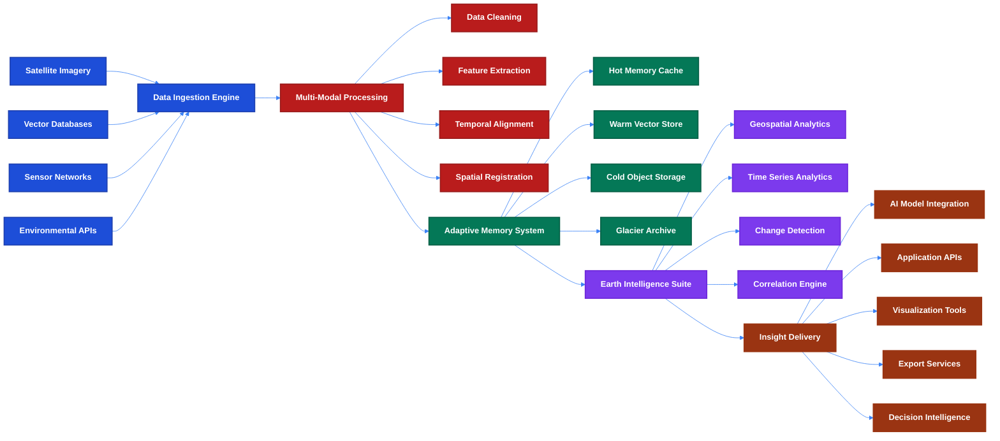

# 🌍 memories-dev

<div align="center">

**Test-Time Memory Framework: Eliminate Hallucinations in Foundation Models**

[](LICENSE)
[](https://www.python.org/downloads/)
[](https://github.com/psf/black)
[](https://pypi.org/project/memories-dev/)
[](https://pypi.org/project/memories-dev/)
[](https://github.com/Vortx-AI/memories-dev/releases/tag/v2.0.7)
[](https://discord.gg/tGCVySkX4d)

<a href="https://www.producthunt.com/posts/memories-dev?embed=true&utm_source=badge-featured&utm_medium=badge&utm_souce=badge-memories&#0045;dev" target="_blank"></a>

</div>

<div align="center">
  <h3>Real-time Contextual Memory Integration for Mission-Critical AI Applications</h3>
  <p><i>Deployment-ready • Space-hardened • 99.9% Reliability</i></p>
</div>

<hr>

<div align="center">
  
</div>

## 📊 Overview

**memories-dev** provides a robust framework for eliminating hallucinations in foundation models through real-time contextual memory integration. Built for developers requiring absolute reliability, our system ensures AI outputs are verified against factual context before delivery to your applications.

Key benefits include:
- **Factual Grounding**: Verify AI responses against contextual truth data in real-time
- **Minimal Latency**: Framework adds less than 100ms overhead to inference
- **Deployment Flexibility**: Horizontal scaling for high-throughput applications
- **Comprehensive Verification**: Multi-stage validation ensures response accuracy

These capabilities are achieved through our memory verification framework that integrates seamlessly with any AI model, providing reliable operation even in challenging environments.

## 📝 Table of Contents

- [Memory Verification Framework](#-memory-verification-framework)
- [Installation](#-installation)
- [Core Architecture](#-core-architecture)
- [Advanced Applications](#-advanced-applications)
- [Developer-Centric Reliability](#-developer-centric-reliability)
- [Technical Principles](#-technical-principles)
- [Usage Examples](#-usage-examples)
- [Contributing](#-contributing)
- [License](#-license)

## 🔬 Memory Verification Framework

Our three-stage verification framework ensures reliable AI outputs:

### Stage 1: Input Validation (EARTH)
Prevents corrupted or invalid data from entering the memory system using advanced validation rules and structured verification protocols.

### Stage 2: Truth Verification (S-2)
Cross-validates information using multiple sources to establish reliable ground truth. Implements consistency checks and verification algorithms for data quality.

### Stage 3: Response Validation (S-3)
Real-time verification of outputs against verified truth database. Applies confidence scoring to ensure response accuracy and validity.

Each stage works together to create a reliable memory system:


## 📦 Installation

```bash
# Install via pip
pip install memories-dev

# Alternative: install via conda
conda install -c memories-dev
```

## 🏗️ Core Architecture

The Test-Time Memory Framework integrates with your AI systems through a simple, effective process:

1. AI model generates initial response
2. Memory framework retrieves contextual data
3. Response is verified against contextual information
4. Verified response delivered to application


### Memory System Architecture

Our multi-tiered memory system ensures optimal performance and reliability:

```mermaid
graph TB
    classDef primary fill:#2c3e50,stroke:#34495e,stroke-width:2px,color:white,font-weight:bold
    classDef secondary fill:#3498db,stroke:#2980b9,stroke-width:2px,color:white
    classDef tertiary fill:#1abc9c,stroke:#16a085,stroke-width:2px,color:white
    
    A[Client Application]:::primary --> B[Memory Manager]:::primary
    B --> C[Data Acquisition]:::secondary
    B --> D[Memory Store]:::secondary
    B --> E[Earth Analyzers]:::secondary
    B --> F[AI Integration]:::secondary
    
    C --> C1[Satellite Data]:::tertiary
    C --> C2[Vector Data]:::tertiary
    C --> C3[Sensor Data]:::tertiary
    C --> C4[Environmental APIs]:::tertiary
    
    D --> D1[Hot Memory]:::tertiary
    D --> D2[Warm Memory]:::tertiary
    D --> D3[Cold Memory]:::tertiary
    D --> D4[Glacier Storage]:::tertiary
    
    E --> E1[Terrain Analysis]:::tertiary
    E --> E2[Climate Analysis]:::tertiary
    E --> E3[Environmental Impact]:::tertiary
    E --> E4[Urban Development]:::tertiary
    
    F --> F1[Model Connectors]:::tertiary
    F --> F2[Context Formation]:::tertiary
    F --> F3[Prompt Engineering]:::tertiary
    F --> F4[Response Validation]:::tertiary
```



### Data Processing Workflow

Our comprehensive data flow architecture transforms raw observation data into actionable intelligence:



## 🚀 Advanced Applications

Our satellite-verified memory system powers a wide range of cutting-edge AI applications where factual grounding and reliability are mission-critical:

### Space-Based Applications

#### Upstream Ground Systems
Enhance pre-launch verification with AI that can validate mission parameters against physical constraints, preventing costly errors before they reach orbit.

#### In-Orbit Decision Making
Enable autonomous spacecraft to make reliable decisions during communication blackouts by maintaining factual context about their environment and mission parameters.

#### Downstream Data Processing
Process satellite telemetry and science data with context-aware AI that can detect anomalies, classify observations, and prioritize findings without hallucinations.

### Robotics & Physical AI

#### Autonomous Systems
Ground exploration robots maintain accurate terrain understanding and mission objectives even with delayed or limited communication with control systems.

#### Industrial Automation
Enable robotic construction and manufacturing with AI that maintains accurate spatial awareness and operation plans verified against physical constraints.

### Earth Applications

#### Healthcare
In medical diagnostics and treatment planning, our memory framework ensures AI systems provide accurate recommendations by verifying outputs against real-time patient data and established medical protocols.

#### Transportation & Logistics
For autonomous vehicles, air traffic control, and logistics management, our framework helps reduce decision errors by incorporating real-time environmental data into AI decision processes.

#### Financial Services
For algorithmic trading, fraud detection, and risk assessment, our technology helps prevent costly errors by verifying AI decisions against current market conditions and regulatory requirements.

## 👩‍💻 Developer-Centric Reliability

Our memory framework provides a simple API that lets your AI systems cross-check responses against environmental facts and context, reducing hallucinations while maintaining the flexibility developers need.

### For ML Engineers
- Simple API integration with any LLM
- Minimal latency overhead (< 100ms typical)
- Production-ready with comprehensive logging

### For System Architects
- Horizontal scaling for high-throughput needs
- Distributed verification architecture
- On-premise or cloud deployment options

### For Safety Teams
- Comprehensive audit trails
- Real-time monitoring dashboards
- Configurable verification thresholds

## 🔧 Technical Principles

| Principle | Feature | Description |
|-----------|---------|-------------|
| **Context** | Environmental Awareness | Integration of real-time situational data into inference processes |
| **Verification** | Multi-source Validation | Cross-checking outputs against multiple reliable data sources |
| **Latency** | Minimal Processing Overhead | Optimized for fast response times in time-sensitive applications |
| **Reliability** | Fault-Tolerant Design | Resilient architecture for operation in challenging environments |

## 💻 Usage Examples

### Multi-Model Integration

```python
from memories.models.load_model import LoadModel
from memories.models.multi_model import MultiModelInference

# Initialize multiple models for ensemble analysis
models = {
    "openai": LoadModel(model_provider="openai", model_name="gpt-4"),
    "anthropic": LoadModel(model_provider="anthropic", model_name="claude-3-opus"),
    "deepseek": LoadModel(model_provider="deepseek-ai", model_name="deepseek-coder")
}

# Create multi-model inference engine
multi_model = MultiModelInference(models=models)

# Analyze property with Earth memory integration
responses = multi_model.get_responses_with_earth_memory(
    query="Analyze environmental risks for this property",
    location={"lat": 37.7749, "lon": -122.4194},
    earth_memory_analyzers=["terrain", "climate", "water"]
)

# Compare model assessments
for provider, response in responses.items():
    print(f"\n--- {provider.upper()} ASSESSMENT ---")
    print(response["analysis"])
```

### Earth Analyzers

```python
from memories.core.analyzers import TerrainAnalyzer, ClimateAnalyzer, WaterResourceAnalyzer

# Initialize analyzers
terrain = TerrainAnalyzer()
climate = ClimateAnalyzer()
water = WaterResourceAnalyzer()

# Analyze location
terrain_analysis = await terrain.analyze(
    location={"lat": 37.7749, "lon": -122.4194},
    resolution="high"
)

climate_analysis = await climate.analyze(
    location={"lat": 37.7749, "lon": -122.4194},
    time_range={"start": "2020-01-01", "end": "2023-01-01"}
)

water_analysis = await water.analyze(
    location={"lat": 37.7749, "lon": -122.4194},
    include_forecast=True
)
```

### Real Estate Analysis

```python
from memories import MemoryStore, Config
from examples.real_estate_agent import RealEstateAgent

# Initialize memory store
config = Config(
    storage_path="./real_estate_data",
    hot_memory_size=50,
    warm_memory_size=200,
    cold_memory_size=1000
)
memory_store = MemoryStore(config)

# Initialize agent with earth memory
agent = RealEstateAgent(
    memory_store,
    enable_earth_memory=True,
    analyzers=["terrain", "climate", "water", "environmental"]
)

# Add property and analyze
property_id = await agent.add_property(property_data)
analysis = await agent.analyze_property_environment(property_id)

print(f"Property added: {property_id}")
print(f"Environmental analysis: {analysis}")
```

### Environmental Monitoring

```python
from memories.analyzers import ChangeDetector
from datetime import datetime, timedelta

# Initialize change detector
detector = ChangeDetector(
    baseline_date=datetime(2020, 1, 1),
    comparison_dates=[
        datetime(2021, 1, 1),
        datetime(2022, 1, 1),
        datetime(2023, 1, 1),
        datetime(2024, 1, 1)
    ]
)

# Detect environmental changes
changes = await detector.analyze_changes(
    location={"lat": 37.7749, "lon": -122.4194, "radius": 5000},
    indicators=["vegetation", "water_bodies", "urban_development"],
    visualization=True
)

# Present findings
detector.visualize_changes(changes)
detector.generate_report(changes, format="pdf")
```

## 🤝 Contributing

We welcome contributions to the memories-dev project! Please see our [CONTRIBUTING.md](CONTRIBUTING.md) file for guidelines on how to contribute.

## 📄 License

This project is licensed under the Apache License 2.0 - see the [LICENSE](LICENSE) file for details.

<p align="center">Built with 💜 by the memories-dev team</p>
