<div align="center">

# memories.dev


**Collective Memory for AGI**

[](https://docs.memories.dev)
[](LICENSE)
[](https://www.python.org/downloads/)
[](https://github.com/psf/black)
[](https://github.com/Vortx-AI/memories-dev/releases/tag/v1.0.2)

<a href="https://www.producthunt.com/posts/memories-dev?embed=true&utm_source=badge-featured&utm_medium=badge&utm_souce=badge-memories&#0045;dev" target="_blank"></a>

</div>

## Overview

memories.dev is a memory infrastructure for providing real-world context to AI models during inference. It processes, indexes, and serves location-tagged intelligence ("memories") from multiple data sources including satellite imagery, climate sensors, and urban development metrics. These memories enhance AI models' understanding and reasoning capabilities with real-world context.


## System Architecture

## Quick Start

```python
from memories_dev.models.load_model import LoadModel
from memories_dev.memories.memory import MemoryStore
from memories_dev.agents.agent import Agent


# Initialize with advanced models
load_model = LoadModel(
    use_gpu= True 
    model_provider= "deepseek-ai" #"deepseek" or "openai"
    deployment_type= "local" #"local" or "api"
    model_name= "deepseek-r1-zero" #"deepseek-r1-zero" or "gpt-4o" or "deepseek-coder-3.1b-base" or "gpt-4o-mini"
    #api_key= #"your-api-key" optional for api deployment
)

# Create Earth memories
memory_store = MemoryStore()

memories = memory_store.create_memories(
    model = load_model,
    location=(37.7749, -122.4194),  # San Francisco coordinates
    time_range=("2024-01-01", "2024-02-01"),
    artifacts={
        "satellite": ["sentinel-2", "landsat8"],
        "landuse": ["osm","overture"]
    }
)


# Generate synthetic data
synthetic_data = vx.generate_synthetic(
    base_location=(37.7749, -122.4194),
    scenario="urban_development",
    time_steps=10,
    climate_factors=True
)

# AGI reasoning with memories
insights = Agent(
    query="Analyze urban development patterns and environmental impact",
    context_memories=memories,
    synthetic_scenarios=synthetic_data
)
```

## Installation

```bash
# Basic installation
pip install memories-dev==1.0.2

# With GPU support
pip install memories-dev[gpu]==1.0.2
```
### Core Components

## 🔄 Workflows

### Memory Formation Pipeline

```mermaid
graph LR
    %% Node Styles
    classDef input fill:#e3f2fd,stroke:#1565c0,stroke-width:2px
    classDef process fill:#f3e5f5,stroke:#6a1b9a,stroke-width:2px
    classDef storage fill:#e8f5e9,stroke:#2e7d32,stroke-width:2px
    
    %% Input Nodes
    I1(("📡 Raw Data")):::input
    I2(("🛰️ Satellite")):::input
    I3(("🌡️ Sensors")):::input
    
    %% Processing Nodes
    P1["🔄 Preprocessing"]:::process
    P2["⚡ Feature Extraction"]:::process
    P3["🧠 Memory Formation"]:::process
    
    %% Storage Nodes
    S1[("💾 Vector Store")]:::storage
    S2[("📊 Time Series DB")]:::storage
    S3[("🗺️ Spatial Index")]:::storage
    
    %% Flow
    I1 & I2 & I3 --> P1
    P1 --> P2
    P2 --> P3
    P3 --> S1 & S2 & S3
```



### Query Pipeline

```mermaid
graph TD
    %% Node Styles
    classDef query fill:#fff3e0,stroke:#e65100,stroke-width:2px
    classDef memory fill:#f3e5f5,stroke:#6a1b9a,stroke-width:2px
    classDef output fill:#e8f5e9,stroke:#2e7d32,stroke-width:2px

    %% Query Flow
    Q1["🔍 Query Request"]:::query
    Q2["📍 Location Filter"]:::query
    Q3["⏱️ Time Filter"]:::query
    
    %% Memory Operations
    M1["🧠 Memory Lookup"]:::memory
    M2["🔄 Context Assembly"]:::memory
    M3["⚡ Real-time Update"]:::memory
    
    %% Output Generation
    O1["📊 Results"]:::output
    O2["📝 Analysis"]:::output
    O3["🔄 Synthesis"]:::output

    %% Connections
    Q1 --> Q2 & Q3
    Q2 & Q3 --> M1
    M1 --> M2 --> M3
    M3 --> O1 & O2 & O3
```



### Agent System

```mermaid
graph TD
    %% Node Styles
    classDef agent fill:#fff3e0,stroke:#e65100,stroke-width:2px
    classDef memory fill:#f3e5f5,stroke:#6a1b9a,stroke-width:2px
    classDef task fill:#e3f2fd,stroke:#1565c0,stroke-width:2px

    %% Agent Components
    subgraph "🤖 Agent System"
        A1["🧠 Reasoning Engine"]:::agent
        A2["🔄 Memory Integration"]:::agent
        A3["📊 Analysis Engine"]:::agent
    end

    %% Memory Access
    subgraph "💾 Memory Access"
        M1["📥 Retrieval"]:::memory
        M2["🔄 Update"]:::memory
        M3["🔍 Query"]:::memory
    end

    %% Task Processing
    subgraph "📋 Tasks"
        T1["📊 Analysis"]:::task
        T2["🔄 Synthesis"]:::task
        T3["📝 Reporting"]:::task
    end

    %% Connections
    A1 --> M1 & M2 & M3
    M1 & M2 & M3 --> A2
    A2 --> A3
    A3 --> T1 & T2 & T3
```




### Memory Architecture


### Data Flow


## 📚 Module Dependencies


## Core Features

### Memory Sources
- Global Points of Interest Database
- Global Places Database
- Cadastral Data & Digital Elevation Models
- Census & Demographics
- Satellite Data:
  - ESA Sentinel-1 & 2
  - NASA Landsat 7/8
  - Custom data source integration

### Key Capabilities
- Real-time memory synthesis during model inference
- Context-aware AI reasoning
- Multi-modal memory fusion
- Temporal pattern analysis
- Location-aware intelligence
- Privacy-preserving memory access

## System Requirements

### Minimum
- Python 3.9+
- 16GB RAM
- 4+ CPU cores
- 20GB storage

### Recommended
- 32GB RAM
- 8+ CPU cores
- NVIDIA GPU (8GB+ VRAM)
- 50GB SSD storage

## Use Cases

- **Enhanced Language Models**: Provide real-world context during inference
- **Report Generation**: Create detailed reports with location-specific insights
- **Trend Analysis**: Analyze temporal patterns with historical context
- **Impact Assessment**: Evaluate environmental and urban development impacts


## Contributing

We welcome contributions! See our [Contributing Guide](CONTRIBUTING.md) for:
- Development Setup
- Code Style Guidelines
- Testing Requirements
- PR Process

## Support

- [GitHub Issues](https://github.com/memories_dev/memories.dev/issues)
- [Discord Community](https://discord.gg/7qAFEekp)
- Email: hello@memories.dev

## License

Apache License 2.0 - See [LICENSE](LICENSE) for details.

---

<div align="center">
<p>Empowering AI with Real-World Context</p>
</div>

