# 🌍 memories-dev

<div align="center">

**Building the World's Memory for Artificial General Intelligence**

[](https://memories-dev.readthedocs.io/index.html)
[](LICENSE)
[](https://www.python.org/downloads/)
[](https://github.com/psf/black)
[](https://github.com/Vortx-AI/memories-dev/releases/tag/v2.0.2)
[](https://discord.gg/tGCVySkX4d)

<a href="https://www.producthunt.com/posts/memories-dev?embed=true&utm_source=badge-featured&utm_medium=badge&utm_souce=badge-memories&#0045;dev" target="_blank"></a>

</div>

> **"The framework that gives AI systems a memory of the physical world through objective Earth observation data."**

## 🚀 What is memories-dev?

**memories-dev** is a groundbreaking Python framework that creates a collective memory system for AI by integrating satellite imagery, geospatial data, and environmental metrics with large language models. Unlike traditional foundation models or RAG systems that rely on potentially biased or outdated text corpora, memories-dev provides AI with direct access to objective Earth observation data - the pure source of truth about our physical world.

<div align="center">
  
</div>

## 🔄 Beyond Traditional AI: Earth Memory vs. Foundation Models & RAG

### Traditional Foundation Models
- ❌ **Limited to text corpora**: Trained on internet text that may contain biases, inaccuracies, and outdated information
- ❌ **No direct observation**: Cannot directly observe or verify physical world conditions
- ❌ **Static knowledge cutoff**: Knowledge frozen at training time with no ability to access current conditions
- ❌ **Hallucination-prone**: Prone to generating plausible but incorrect information about the physical world
- ❌ **No temporal understanding**: Cannot track how places change over time

### Traditional RAG Systems
- ❌ **Document-centric**: Limited to retrieving text documents rather than rich multi-modal Earth data
- ❌ **Unstructured data**: Typically works with unstructured text rather than structured geospatial information
- ❌ **Limited context window**: Struggles with complex spatial and temporal relationships
- ❌ **No specialized analyzers**: Lacks domain-specific tools for environmental and geospatial analysis
- ❌ **No multi-dimensional scoring**: Cannot evaluate locations across multiple environmental dimensions

### memories-dev Earth Memory System
- ✅ **Direct observation**: Integrates real satellite imagery and sensor data as ground truth
- ✅ **Multi-modal data fusion**: Combines visual, vector, and environmental data for comprehensive understanding
- ✅ **Temporal awareness**: Tracks changes over time with historical imagery and predictive capabilities
- ✅ **Specialized analyzers**: 15+ domain-specific analyzers for terrain, climate, biodiversity, and more
- ✅ **Objective source of truth**: Based on actual Earth observation data rather than potentially biased text
- ✅ **Spatial reasoning**: Native understanding of geographic relationships and spatial context
- ✅ **Tiered memory architecture**: Optimized storage and retrieval across hot, warm, cold, and glacier tiers
- ✅ **Asynchronous processing**: 10x faster analysis through parallel execution of multiple Earth analyzers

### Foundation Models + Earth Memory Integration

```mermaid
%%{init: {'theme': 'forest', 'themeVariables': { 'primaryColor': '#1f77b4', 'primaryTextColor': '#fff', 'primaryBorderColor': '#0d6efd', 'lineColor': '#3498db', 'secondaryColor': '#16a085', 'tertiaryColor': '#2980b9'}}}%%
graph TD
    classDef foundationModels fill:#3498db,stroke:#2980b9,stroke-width:2px,color:white,font-weight:bold
    classDef earthMemory fill:#16a085,stroke:#1abc9c,stroke-width:2px,color:white,font-weight:bold
    classDef contextNodes fill:#9b59b6,stroke:#8e44ad,stroke-width:2px,color:white
    classDef intelligenceNodes fill:#f39c12,stroke:#f1c40f,stroke-width:2px,color:white
    classDef memoryNode fill:#e74c3c,stroke:#c0392b,stroke-width:2px,color:white,font-weight:bold
    classDef appNode fill:#2c3e50,stroke:#34495e,stroke-width:2px,color:white,font-weight:bold
    
    A[🤖 Foundation Models] -->|Augmented with| B[🌍 Earth Memory]
    B -->|Provides| C[📍 Spatial Context]
    B -->|Provides| D[⏱️ Temporal Context]
    B -->|Provides| E[🌱 Environmental Context]
    C -->|Enables| F[📌 Location-Aware Intelligence]
    D -->|Enables| G[⏰ Time-Aware Intelligence]
    E -->|Enables| H[🌿 Environment-Aware Intelligence]
    F --> I[🧠 Collective AGI Memory]
    G --> I
    H --> I
    I -->|Powers| J[🚀 Next-Gen AI Applications]
    
    A:::foundationModels
    B:::earthMemory
    C:::contextNodes
    D:::contextNodes
    E:::contextNodes
    F:::intelligenceNodes
    G:::intelligenceNodes
    H:::intelligenceNodes
    I:::memoryNode
    J:::appNode

    linkStyle 0 stroke:#3498db,stroke-width:2px,stroke-dasharray: 5 5
    linkStyle 1,2,3 stroke:#16a085,stroke-width:2px
    linkStyle 4,5,6 stroke:#9b59b6,stroke-width:2px
```


## 🏗️ System Architecture

### Core System Components


### Data Flow Architecture


### Memory Management System


## 🌟 Key Features

### 1. Multi-Modal Earth Memory Integration

```mermaid
%%{init: {'theme': 'forest', 'themeVariables': { 'primaryColor': '#2c3e50', 'primaryTextColor': '#ecf0f1', 'primaryBorderColor': '#34495e', 'lineColor': '#3498db', 'secondaryColor': '#16a085', 'tertiaryColor': '#2980b9'}}}%%
graph TD
    classDef mainSystem fill:#1e293b,stroke:#334155,stroke-width:2px,color:white,font-weight:bold
    classDef terrainAnalyzer fill:#3b82f6,stroke:#2563eb,stroke-width:2px,color:white,font-weight:bold
    classDef climateAnalyzer fill:#ef4444,stroke:#dc2626,stroke-width:2px,color:white,font-weight:bold
    classDef environmentalAnalyzer fill:#10b981,stroke:#059669,stroke-width:2px,color:white,font-weight:bold
    classDef landAnalyzer fill:#8b5cf6,stroke:#7c3aed,stroke-width:2px,color:white,font-weight:bold
    classDef waterAnalyzer fill:#0ea5e9,stroke:#0284c7,stroke-width:2px,color:white,font-weight:bold
    classDef geologicalAnalyzer fill:#f59e0b,stroke:#d97706,stroke-width:2px,color:white,font-weight:bold
    classDef urbanAnalyzer fill:#6366f1,stroke:#4f46e5,stroke-width:2px,color:white,font-weight:bold
    classDef bioAnalyzer fill:#84cc16,stroke:#65a30d,stroke-width:2px,color:white,font-weight:bold
    classDef airAnalyzer fill:#06b6d4,stroke:#0891b2,stroke-width:2px,color:white,font-weight:bold
    classDef noiseAnalyzer fill:#ec4899,stroke:#db2777,stroke-width:2px,color:white,font-weight:bold
    classDef solarAnalyzer fill:#eab308,stroke:#ca8a04,stroke-width:2px,color:white,font-weight:bold
    classDef walkAnalyzer fill:#14b8a6,stroke:#0d9488,stroke-width:2px,color:white,font-weight:bold
    classDef viewAnalyzer fill:#8b5cf6,stroke:#7c3aed,stroke-width:2px,color:white,font-weight:bold
    classDef microAnalyzer fill:#22c55e,stroke:#16a34a,stroke-width:2px,color:white,font-weight:bold
    classDef propertyAnalyzer fill:#f43f5e,stroke:#e11d48,stroke-width:2px,color:white,font-weight:bold
    classDef infraAnalyzer fill:#6366f1,stroke:#4f46e5,stroke-width:2px,color:white,font-weight:bold
    classDef subAnalyzer fill:#64748b,stroke:#475569,stroke-width:1px,color:white
    
    A[🧠 Earth Memory Analyzers] --> B[🏔️ TerrainAnalyzer]
    A --> C[🌡️ ClimateDataFetcher]
    A --> D[🌱 EnvironmentalImpactAnalyzer]
    A --> E[🏞️ LandUseClassifier]
    A --> F[💧 WaterResourceAnalyzer]
    A --> G[🪨 GeologicalDataFetcher]
    A --> H[🏙️ UrbanDevelopmentAnalyzer]
    A --> I[🦋 BiodiversityAnalyzer]
    A --> J[💨 AirQualityMonitor]
    A --> K[🔊 NoiseAnalyzer]
    A --> L[☀️ SolarPotentialCalculator]
    A --> M[🚶 WalkabilityAnalyzer]
    A --> N[👁️ ViewshedAnalyzer]
    A --> O[🌤️ MicroclimateAnalyzer]
    A --> P[💰 PropertyValuePredictor]
    A --> Q[🛣️ InfrastructureAnalyzer]
    
    B --> B1[📏 Elevation Analysis]
    B --> B2[📐 Slope Analysis]
    B --> B3[🧭 Aspect Analysis]
    B --> B4[⚠️ Landslide Risk]
    
    C --> C1[📈 Temperature Trends]
    C --> C2[🌧️ Precipitation Patterns]
    C --> C3[🔮 Climate Projections]
    C --> C4[🌪️ Extreme Weather Risk]
    
    F --> F1[🌊 Flood Risk Assessment]
    F --> F2[🧪 Water Quality Analysis]
    F --> F3[🏜️ Drought Risk Modeling]
    F --> F4[🏞️ Watershed Analysis]
    
    H --> H1[📊 Urban Growth Patterns]
    H --> H2[📋 Development Plans]
    H --> H3[🏗️ Infrastructure Analysis]
    H --> H4[🏢 Zoning Changes]
    
    A:::mainSystem
    B:::terrainAnalyzer
    C:::climateAnalyzer
    D:::environmentalAnalyzer
    E:::landAnalyzer
    F:::waterAnalyzer
    G:::geologicalAnalyzer
    H:::urbanAnalyzer
    I:::bioAnalyzer
    J:::airAnalyzer
    K:::noiseAnalyzer
    L:::solarAnalyzer
    M:::walkAnalyzer
    N:::viewAnalyzer
    O:::microAnalyzer
    P:::propertyAnalyzer
    Q:::infraAnalyzer
    
    B1:::subAnalyzer
    B2:::subAnalyzer
    B3:::subAnalyzer
    B4:::subAnalyzer
    C1:::subAnalyzer
    C2:::subAnalyzer
    C3:::subAnalyzer
    C4:::subAnalyzer
    F1:::subAnalyzer
    F2:::subAnalyzer
    F3:::subAnalyzer
    F4:::subAnalyzer
    H1:::subAnalyzer
    H2:::subAnalyzer
    H3:::subAnalyzer
    H4:::subAnalyzer
```



### 2. Tiered Memory Architecture

Our sophisticated memory management system optimizes data storage and retrieval:

```python
from memories import MemoryStore, Config

# Configure tiered memory architecture
memory_system = MemoryStore(
    store_type="vector",  # Options: "vector", "graph", "hybrid"
    vector_store="milvus",
    embedding_model="text-embedding-3-small"
)

# Store a memory with multi-modal data
memory_id = memory_system.store(
    content={
        "satellite_imagery": satellite_data,
        "vector_features": vector_data,
        "text_description": "Urban area with mixed residential and commercial buildings"
    },
    metadata={
        "location": bbox,
        "timestamp": "2025-02-15T10:30:00Z",
        "source": "satellite_analysis"
    }
)

# Query memories with context
relevant_memories = memory_system.query(
    query="What is the building density in this urban area?",
    location=bbox,
    time_range=("2025-01-01", "2025-02-15")
)
```

### 3. Advanced Earth Analyzers

```python
from memories.analyzers import TerrainAnalyzer, ClimateAnalyzer, BiodiversityAnalyzer

# Initialize analyzers
terrain = TerrainAnalyzer()
climate = ClimateAnalyzer()
biodiversity = BiodiversityAnalyzer()

# Analyze location
terrain_data = await terrain.analyze(location=bbox)
climate_data = await climate.analyze(location=bbox)
biodiversity_data = await biodiversity.analyze(location=bbox)

# Generate comprehensive report
report = Report.generate(
    terrain=terrain_data,
    climate=climate_data,
    biodiversity=biodiversity_data,
    format="interactive"
)
```

## 🔍 Real-World Applications

### Environmental Monitoring
- Track deforestation and reforestation patterns
- Monitor urban growth and sprawl
- Assess impacts of climate change on landscapes
- Identify areas at risk of natural disasters

### Urban Planning
- Analyze infrastructure development needs
- Evaluate land use efficiency
- Assess transportation network effectiveness
- Identify areas for green space development

### Real Estate Analysis
- Comprehensive property evaluation across multiple dimensions
- Historical analysis of neighborhood development
- Future projections of property values based on environmental factors
- Comparative analysis of similar properties

### Agricultural Management
- Crop health monitoring
- Soil moisture analysis
- Yield prediction
- Irrigation optimization

## 🏗️ Installation

### Standard Installation
```bash
# Basic installation
pip install memories-dev

# With GPU support
pip install memories-dev[gpu]

# Full installation with all features
pip install memories-dev[all]
```

### Development Installation
```bash
# Clone repository
git clone https://github.com/Vortx-AI/memories-dev.git
cd memories-dev

# Install development dependencies
pip install -e ".[dev]"

# Install documentation tools
pip install -e ".[docs]"
```

## 🔧 System Requirements

### Minimum (Development)
- Python 3.9+
- 16GB RAM
- 4+ CPU cores
- 20GB storage
- Docker & Docker Compose (for local development)

### Production (Recommended)
- 32GB+ RAM
- 8+ CPU cores
- NVIDIA GPU with 8GB+ VRAM
- 100GB+ SSD storage
- Kubernetes cluster for distributed deployment

## 📊 Monitoring & Observability

### Available in v2.0.2
- Comprehensive logging system with structured output
- Memory operation metrics with Prometheus integration
- Performance tracking for core operations
- Health check endpoints
- Grafana dashboards for memory metrics
- Real-time memory operation monitoring
- Advanced performance analytics
- Automated alerting system

## 📁 Project Structure

```
memories/
├── core/            # Core memory system
│   ├── memory_manager.py # Memory management
│   └── policies.py # Memory policies
│
├── data_acquisition/ # Data Collection
│   ├── sources/     # Data sources
│   │   ├── sentinel_api.py # Sentinel-2
│   │   ├── landsat_api.py # Landsat
│   │   ├── osm_api.py # OpenStreetMap
│   │   ├── overture_api.py # Overture Maps
│   │   ├── wfs_api.py # WFS
│   │   └── planetary_compute.py # Planetary Computer
│   ├── processing/ # Data processing
│   │   ├── cloud_mask.py # Cloud masking
│   │   ├── indices.py # Spectral indices
│   │   ├── fusion.py # Data fusion
│   │   └── validation.py # Data validation
│   └── data_manager.py # Data management
│
├── models/          # AI Models
│   ├── base_model.py # Base model implementation
│   ├── load_model.py # Model loader
│   ├── api_connector.py # API connectors
│   ├── streaming.py # Streaming responses
│   ├── caching.py # Response caching
│   ├── function_calling.py # Function calling
│   └── multi_model.py # Multi-model inference
```

## 🌟 Scientific Validation

memories-dev is built on scientifically validated Earth observation techniques:

- **Satellite Imagery Analysis**: Leverages proven remote sensing methodologies for extracting insights from multi-spectral imagery
- **Environmental Metrics**: Uses established scientific methods for measuring environmental conditions
- **Temporal Analysis**: Employs validated change detection algorithms for tracking changes over time
- **Spatial Analysis**: Utilizes geospatial analysis techniques from the GIS scientific community
- **Data Fusion**: Implements peer-reviewed approaches for combining multiple data sources

## 📚 Documentation

For comprehensive documentation, visit [memories-dev.readthedocs.io](https://memories-dev.readthedocs.io/).

## 🤝 Contributing

We welcome contributions from the community! See [CONTRIBUTING.md](CONTRIBUTING.md) for guidelines.

## 📄 License

This project is licensed under the Apache License 2.0 - see the [LICENSE](LICENSE) file for details.

<p align="center">Built with 💜 by the memories-dev team</p>
