<div align="center">

# memories.dev

**Contextual Memory Infrastructure for AI Systems**

[](https://docs.memories.dev)
[](LICENSE)
[](https://www.python.org/downloads/)
[](https://github.com/psf/black)

</div>

## Overview

memories.dev is a high-performance infrastructure for providing real-world context to AI models during inference. It processes, indexes, and serves location-tagged intelligence ("memories") from multiple data sources including satellite imagery, climate sensors, and urban development metrics. These memories enhance AI models' understanding and reasoning capabilities with real-world context.

## Core Features

### Memory Sources
- Global Points of Interest Database
- Global Places Database
- Cadastral Data & Digital Elevation Models
- Census & Demographics
- Satellite Data:
  - ESA Sentinel-1 & 2
  - NASA Landsat 7/8
  - Custom data source integration

### Key Capabilities
- Real-time memory retrieval during model inference
- Context-aware AI reasoning
- Multi-modal memory fusion
- Temporal pattern analysis
- Location-aware intelligence
- Privacy-preserving memory access

## System Architecture

```mermaid
graph TD
    classDef sourceNode fill:#e1f5fe,stroke:#01579b,stroke-width:2px;
    classDef processNode fill:#f3e5f5,stroke:#4a148c,stroke-width:2px;
    classDef aiNode fill:#fff3e0,stroke:#e65100,stroke-width:2px;
    classDef storeNode fill:#e8f5e9,stroke:#1b5e20,stroke-width:2px;
    classDef outputNode fill:#fce4ec,stroke:#880e4f,stroke-width:2px;

    subgraph "🌍 Memory Sources"
        S1["🛰️ Satellite Networks"]
        S2["📡 Ground Stations"]
        S3["🌡️ Climate Sensors"]
        S4["📊 Census Data"]
        S5["🏢 Urban Metrics"]
    end

    subgraph "🧠 Memory Processing"
        M1["🔄 Memory Formation"]
        M2["🔍 Feature Extraction"]
        M3["🏷️ Semantic Tagging"]
        M4["📍 Geo-Indexing"]
    end

    subgraph "💾 Memory Store"
        DB1["🗄️ Vector Store"]
        DB2["📅 Time Series DB"]
        DB3["🌐 Spatial Index"]
    end

    subgraph "🤖 AI Integration"
        AI1["📥 Memory Retrieval"]
        AI2["🔄 Context Injection"]
        AI3["💡 Enhanced Inference"]
        AI4["🎯 Response Generation"]
    end

    subgraph "📊 Output Layer"
        O1["📑 Reports"]
        O2["📈 Analytics"]
        O3["🤖 API Responses"]
        O4["🔄 Real-time Feeds"]
    end

    S1 & S2 & S3 & S4 & S5 --> M1
    M1 --> M2 --> M3 --> M4
    M4 --> DB1 & DB2 & DB3
    DB1 & DB2 & DB3 --> AI1
    AI1 --> AI2 --> AI3 --> AI4
    AI4 --> O1 & O2 & O3 & O4

    class S1,S2,S3,S4,S5 sourceNode;
    class M1,M2,M3,M4 processNode;
    class DB1,DB2,DB3 storeNode;
    class AI1,AI2,AI3,AI4 aiNode;
    class O1,O2,O3,O4 outputNode;
```



## Quick Start

```python
from memories-dev.vortx import memories-dev
from memories-dev.memories.earth_memory import EarthMemoryStore
from memories-dev.agents.agent import Agent


# Initialize with advanced models
vx = Vortx(
    models={
        "reasoning": deepseek-coder-small,
        "vision": deepseek-vision-small
    },
    use_gpu=True
)

# Create Earth memories
memory_store = EarthMemoryStore()
memories = memory_store.create_memories(
    location=(37.7749, -122.4194),
    time_range=("2020-01-01", "2024-01-01"),
    modalities=["satellite", "climate", "social"]
)

# Generate synthetic data
synthetic_data = vx.generate_synthetic(
    base_location=(37.7749, -122.4194),
    scenario="urban_development",
    time_steps=10,
    climate_factors=True
)

# AGI reasoning with memories
insights = Agent(
    query="Analyze urban development patterns and environmental impact",
    context_memories=memories,
    synthetic_scenarios=synthetic_data
)
```

## Installation

```bash
# Basic installation (Coming Soon)
pip install memories-dev

# With GPU support (Coming Soon)
pip install memories-dev[gpu]
```

## System Requirements

### Minimum
- Python 3.9+
- 16GB RAM
- 4+ CPU cores
- 20GB storage

### Recommended
- 32GB RAM
- 8+ CPU cores
- NVIDIA GPU (8GB+ VRAM)
- 50GB SSD storage

## Use Cases

- **Enhanced Language Models**: Provide real-world context during inference
- **Report Generation**: Create detailed reports with location-specific insights
- **Trend Analysis**: Analyze temporal patterns with historical context
- **Impact Assessment**: Evaluate environmental and urban development impacts
- **Decision Support**: Aid decision-making with contextual intelligence


## Contributing

We welcome contributions! See our [Contributing Guide](CONTRIBUTING.md) for:
- Development Setup
- Code Style Guidelines
- Testing Requirements
- PR Process

## Support

- [GitHub Issues](https://github.com/memories-dev/memories.dev/issues)
- [Discord Community](https://discord.gg/7qAFEekp)
- Email: hello@memories.dev

## License

Apache License 2.0 - See [LICENSE](LICENSE) for details.

---

<div align="center">
<p>Empowering AI with Real-World Context</p>
</div>
