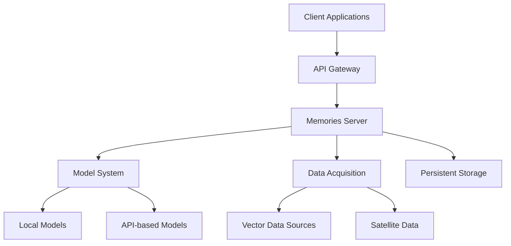
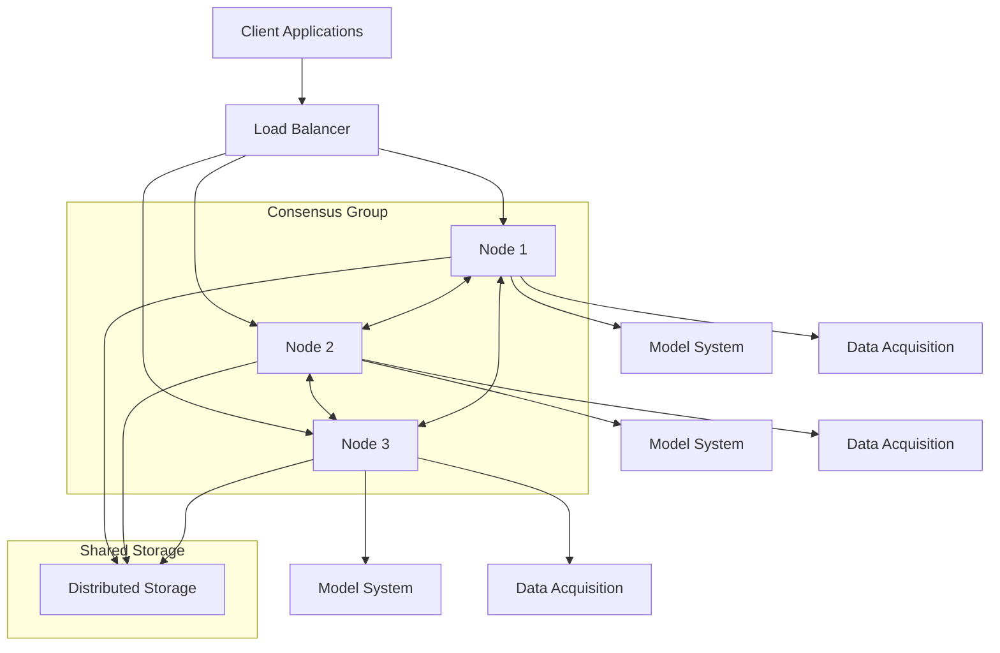
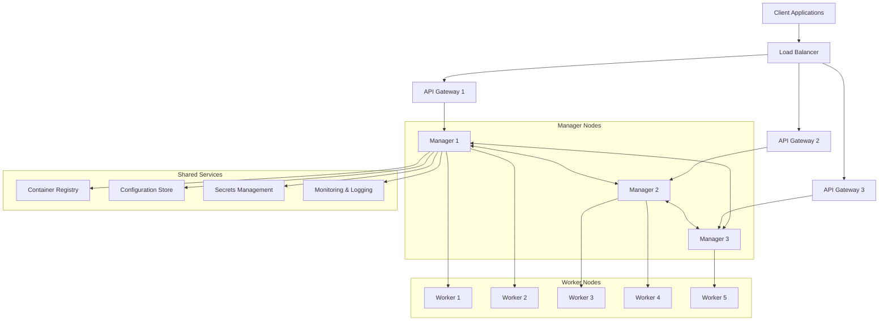

# Memories Deployment Architecture

This document outlines the deployment architecture for the Memories application, detailing three distinct deployment patterns: Standalone, Consensus, and Swarmed.

## What's New in Version 2.0.4 (Scheduled for March 3, 2025)

Since our initial release (v1.0.0 on February 14, 2025), we've made significant improvements to our deployment architecture:

### Deployment Enhancements
- **Improved GPU Support**: Enhanced CUDA optimization for better performance on NVIDIA GPUs
- **Multi-provider Integration**: Seamless integration with DeepSeek AI, Mistral AI, and Cohere
- **Memory Optimization**: Reduced memory footprint for more efficient resource utilization

### Cloud Provider Updates
- **GCP Improvements**: Enhanced support for Google Cloud TPUs
- **AWS Graviton Support**: Optimized performance on ARM-based instances
- **Azure Container Apps**: Simplified deployment on Azure Container Apps

### Security Improvements
- **Enhanced Encryption**: End-to-end encryption for all data in transit and at rest
- **Role-Based Access Control**: Granular access control for deployment management
- **Audit Logging**: Comprehensive audit trails for all deployment operations

## Deployment Patterns

### Standalone Deployment

The Standalone deployment pattern is designed for single-instance deployments where simplicity and ease of management are priorities.



**Key Features:**
- Single-instance deployment
- Simplified management and configuration
- Suitable for development, testing, and small-scale production
- Supports all core functionality
- Easy scaling to other deployment patterns

### Consensus Deployment

The Consensus deployment pattern uses a distributed consensus algorithm to ensure high availability and data consistency across multiple nodes.



**Key Features:**
- Multi-node deployment with consensus algorithm
- High availability and fault tolerance
- Strong consistency guarantees
- Automatic leader election and failover
- Suitable for mission-critical applications

### Swarmed Deployment

The Swarmed deployment pattern uses a container orchestration system to manage a large number of nodes, providing high scalability and resilience.



**Key Features:**
- Container-based deployment with orchestration
- Highly scalable and elastic
- Self-healing infrastructure
- Rolling updates with zero downtime
- Suitable for large-scale, dynamic workloads

## Folder Structure

The deployment configurations are organized by deployment pattern and cloud provider:

```
deployments/
├── standalone/
│   ├── aws/
│   ├── azure/
│   └── gcp/
├── consensus/
│   ├── aws/
│   ├── azure/
│   └── gcp/
└── swarmed/
    ├── aws/
    ├── azure/
    └── gcp/
```

## Configuration Examples

### Standalone on GCP (New in 2.0.4)

```yaml
deployment:
  type: standalone
  provider: gcp
  region: us-west1
  zone: us-west1-a
  
hardware:
  machine_type: n2-standard-4
  gpu: 
    type: nvidia-tesla-t4
    count: 1
  memory: 16GB
  disk:
    type: pd-ssd
    size: 100GB
    
software:
  container_image: memories/standalone:2.0.4
  environment:
    MODEL_PROVIDER: deepseek-ai
    MODEL_NAME: deepseek-coder-small
    USE_GPU: "true"
    
networking:
  vpc_name: memories-vpc
  subnet_name: memories-subnet
  public_ip: true
  firewall:
    allow_http: true
    allow_https: true
```

### Consensus on AWS (New in 2.0.4)

```yaml
deployment:
  type: consensus
  provider: aws
  region: us-west-2
  
consensus:
  algorithm: raft
  min_nodes: 3
  max_nodes: 5
  quorum_size: 2
  
nodes:
  - id: node1
    instance_type: t3.medium
    zone: us-west-2a
  - id: node2
    instance_type: t3.medium
    zone: us-west-2b
  - id: node3
    instance_type: t3.medium
    zone: us-west-2c
    
networking:
  vpc_id: vpc-12345
  subnet_ids: 
    - subnet-a1b2c3
    - subnet-d4e5f6
    - subnet-g7h8i9
  security_groups:
    - sg-consensus-nodes
    - sg-consensus-lb
    
load_balancer:
  type: application
  scheme: internet-facing
  listeners:
    - port: 443
      protocol: HTTPS
      certificate_arn: arn:aws:acm:us-west-2:123456789012:certificate/abcdef
```

### Swarmed on Azure (New in 2.0.4)

```yaml
deployment:
  type: swarmed
  provider: azure
  location: westus2
  resource_group: memories-rg
  
swarm:
  min_nodes: 3
  max_nodes: 10
  manager_nodes: 3
  worker_nodes: 5
  
node_specs:
  manager:
    instance_type: Standard_D2s_v3
    storage_size: 100
  worker:
    instance_type: Standard_B2s
    storage_size: 50
    
networking:
  vnet_name: swarmed-vnet
  subnet_name: swarmed-subnet
  nsg_name: swarmed-nsg
  
scaling:
  min_worker_nodes: 3
  max_worker_nodes: 10
  target_cpu_utilization: 70
```

## Migration Guide from Previous Versions

If you're upgrading from v1.0.0 (February 14, 2025) to v2.0.4 (March 3, 2025), please note the following changes:

### Configuration Updates
- The `model_provider` field now supports additional values: `deepseek-ai`, `mistral-ai`, and `cohere`
- The `hardware` section now includes GPU configuration options
- The `networking` section has been expanded with additional security options

### Hardware Requirements
- Minimum RAM increased from 8GB to 16GB for optimal performance
- GPU support now includes NVIDIA T4, A100, and AMD MI100
- Storage requirements increased from 50GB to 100GB

### API Changes
- The deployment API now uses v2 endpoints
- Authentication now requires OAuth 2.0 tokens
- New endpoints for monitoring and scaling operations

## Deployment Selection Guide

Use this guide to select the appropriate deployment pattern based on your needs:

| Requirement | Standalone | Consensus | Swarmed |
|-------------|------------|-----------|---------|
| Simplicity | ✅ | ⚠️ | ❌ |
| Cost | ✅ | ⚠️ | ❌ |
| Scalability | ❌ | ⚠️ | ✅ |
| High Availability | ❌ | ✅ | ✅ |
| Fault Tolerance | ❌ | ✅ | ✅ |
| Data Consistency | ⚠️ | ✅ | ⚠️ |
| Dynamic Workloads | ❌ | ⚠️ | ✅ |
| Resource Efficiency | ✅ | ⚠️ | ✅ |

## Getting Started

To deploy the Memories application:

1. Choose a deployment pattern based on your requirements
2. Select a cloud provider (AWS, Azure, or GCP)
3. Configure the deployment using the provided templates
4. Run the deployment script:

```bash
cd deployments/<pattern>/<provider>
./deploy.sh --config config.yaml
```

## Coming in Version 2.1.0 (March 2025)

- **Maxar Integration**: Access to Maxar's high-resolution satellite imagery
- **Sentinel-3 Support**: Integration with Sentinel-3 OLCI and SLSTR instruments
- **Kubernetes Support**: Native Kubernetes deployment configurations
- **Multi-region Deployment**: Support for deploying across multiple regions
- **Hybrid Cloud**: Support for deploying across multiple cloud providers

## Troubleshooting

### Standalone Deployment Issues
- **Connection Refused**: Check that the server is running and the firewall allows connections
- **Out of Memory**: Increase the instance size or enable swap
- **Slow Performance**: Enable GPU support or increase CPU allocation

### Consensus Deployment Issues
- **Split Brain**: Ensure quorum size is set correctly (n/2 + 1)
- **Node Failure**: Check network connectivity and instance health
- **Consensus Timeout**: Adjust timeout settings in the configuration

### Swarmed Deployment Issues
- **Container Crashes**: Check logs for error messages
- **Scaling Issues**: Verify autoscaling configuration
- **Network Connectivity**: Ensure all nodes can communicate with each other

<p align="center">Built with 💜 by the memories-dev team</p>