# Memories Application Deployment Architecture

## Overview
This document outlines the deployment architecture for the Memories application, featuring three distinct deployment patterns: Standalone, Consensus, and Swarmed. Each pattern is optimized for specific memory management and processing requirements.

## Deployment Patterns

### 1. Standalone Deployments

```mermaid
graph TD
    A[🖥️ Standalone Server] --> B[⚙️ Hardware Layer]
    B --> C[💾 Memory Management]
    B --> D[🎮 GPU Acceleration]
    
    subgraph "Hardware Optimization"
        E[⚡ CUDA Optimization]
        F[🔄 Memory Pools]
        G[📊 GPU Memory]
    end
    
    subgraph "Memory Management"
        H[📈 Dynamic Allocation]
        I[🔒 Memory Protection]
        J[♻️ Garbage Collection]
    end
```


**Use Cases:**
- Single-tenant applications requiring dedicated resources
- High-performance computing workloads
- Machine learning model inference
- Real-time data processing

**Key Features:**
- Dedicated hardware resources
- Direct GPU access
- Optimized memory management
- Low latency processing

### 2. Consensus Deployments

```mermaid
graph TD
    A[🌐 Consensus Cluster] --> B[📊 Leader Node]
    A --> C[💻 Follower Node 1]
    A --> D[💻 Follower Node 2]
    
    subgraph "Consensus Protocol"
        E[🔄 State Replication]
        F[🔐 Leader Election]
        G[📝 Log Consistency]
    end
    
    subgraph "High Availability"
        H[⚖️ Load Balancing]
        I[🔄 Automatic Failover]
        J[🔍 Health Monitoring]
    end
```


**Use Cases:**
- Distributed databases
- Blockchain networks
- Distributed caching systems
- Mission-critical applications

**Key Features:**
- Strong consistency guarantees
- Fault tolerance
- Automatic leader election
- Data replication

### 3. Swarmed Deployments

```mermaid
graph TD
    A[🐝 Swarm Manager] --> B[📱 Edge Node 1]
    A --> C[📱 Edge Node 2]
    A --> D[📱 Edge Node N]
    
    subgraph "Edge Processing"
        E[⚡ Local Processing]
        F[🔄 Data Sync]
        G[📊 Load Distribution]
    end
    
    subgraph "Cloud Integration"
        H[☁️ Cloud Storage]
        I[🔄 State Management]
        J[📈 Analytics]
    end
```


**Use Cases:**
- Edge computing applications
- Content delivery networks
- IoT device networks
- Globally distributed applications

**Key Features:**
- Edge processing capabilities
- Automatic scaling
- Geographic distribution
- Efficient data synchronization

## Folder Structure
```
deployments/
├── standalone/
│   ├── aws/
│   │   ├── config/
│   │   └── hardware/
│   ├── azure/
│   │   ├── config/
│   │   └── hardware/
│   └── gcp/
│       ├── config/
│       └── hardware/
├── consensus/
│   ├── aws/
│   │   ├── config/
│   │   └── hardware/
│   ├── azure/
│   │   ├── config/
│   │   └── hardware/
│   └── gcp/
│       ├── config/
│       └── hardware/
└── swarmed/
    ├── aws/
    │   ├── config/
    │   └── hardware/
    ├── azure/
    │   ├── config/
    │   └── hardware/
    └── gcp/
        ├── config/
        └── hardware/
```

## Configuration Details

### Hardware Configurations
Each deployment type includes specific hardware configurations:
- **CPU**: Architecture, model, vCPUs, clock speeds
- **Memory**: RAM, swap, storage optimization
- **GPU**: CUDA support, memory, optimization
- **Network**: Bandwidth, optimization, security

### Cloud Provider Support
- **AWS**: EC2, EBS, VPC, Security Groups
- **Azure**: VM, Managed Disks, VNet, NSGs
- **GCP**: Compute Engine, Persistent Disks, VPC, Firewall Rules

### Security Features
- Encryption at rest and in transit
- IAM/RBAC integration
- Network policies and security groups
- Authentication and authorization

### Monitoring and Logging
- Performance metrics collection
- Health monitoring
- Log aggregation
- Alert management

## Deployment Selection Guide

### Choose Standalone When:
- Need maximum performance
- Require dedicated resources
- Have predictable workloads
- Need direct hardware access

### Choose Consensus When:
- Require strong consistency
- Need high availability
- Have distributed state
- Need automatic failover

### Choose Swarmed When:
- Need global distribution
- Have edge processing requirements
- Want automatic scaling
- Need geographic redundancy

## Getting Started
1. Choose your deployment pattern
2. Select your cloud provider
3. Configure hardware requirements
4. Apply security settings
5. Deploy and monitor

For detailed deployment instructions, refer to the specific deployment type documentation in their respective directories.