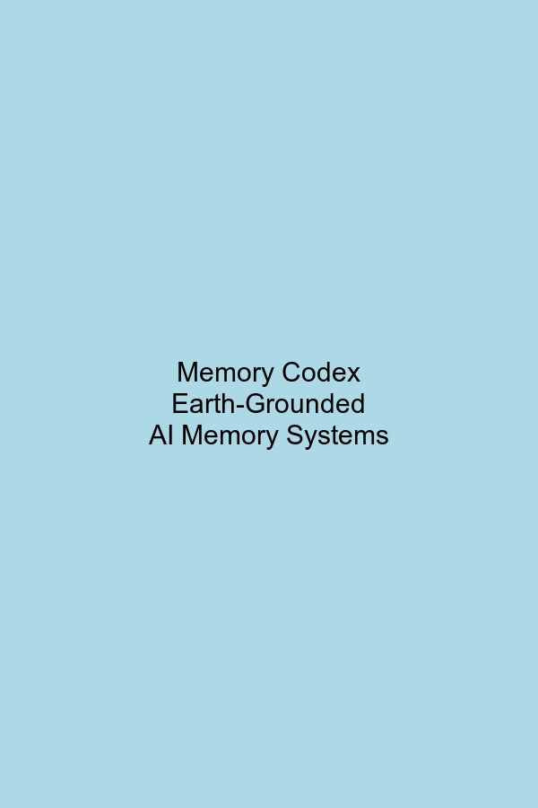

.. memories-dev documentation master file, version 2.0.3

==================================================
Memory Codex: Earth-Grounded AI Memory Systems
==================================================

.. raw:: html

   

     

       <h1>memories-dev 2.0.3</h1>
       
The Future of Earth-Grounded AI Memory • Est. 2025

       

         Production-Ready
         Enterprise Support
         ISO 27001 Certified
       

     

   

.. raw:: html

   

     

       v2.0.3
       Released: March 2025
     

     

       
       
       
       
     

   

Welcome to Memory Codex, a framework that reimagines how artificial intelligence understands, stores, and retrieves information. This book guides you through the journey of creating AI systems with deep understanding of Earth's systems through scientifically rigorous memory.

.. admonition:: What is Memory Codex?
   :class: note

   Memory Codex is a comprehensive framework for building AI systems with Earth-grounded memory. It provides:
   
   * **Structured Memory Architecture**: Multi-tiered memory system for efficient data management
   * **Scientific Foundations**: Earth science principles for reliable AI reasoning
   * **Temporal & Spatial Understanding**: Comprehensive analysis across time and space
   * **Practical Implementation**: Ready-to-use components for real-world applications
   * **Extensible Design**: Flexible architecture for custom memory systems
   * **Enterprise Integration**: Seamless connection with existing data ecosystems
   * **Real-time Processing**: High-performance computing for time-critical applications
   * **Regulatory Compliance**: Built-in features for data governance and compliance

.. mermaid::

   graph TD
      A[Memory Codex] --> B[Earth Observation]
      A --> C[Memory Architecture]
      A --> D[AI Integration]
      
      B --> B1[Data Sources]
      B --> B2[Scientific Analysis]
      
      C --> C1[Hot Memory]
      C --> C2[Warm Memory]
      C --> C3[Cold Memory]
      C --> C4[Glacier Memory]
      
      D --> D1[Query Interface]
      D --> D2[Reasoning Engine]
      D --> D3[Application APIs]
      
      style A fill:#0066cc,stroke:#004080,stroke-width:2px,color:#ffffff
      style B fill:#4db8ff,stroke:#0099ff,stroke-width:1px
      style C fill:#4db8ff,stroke:#0099ff,stroke-width:1px
      style D fill:#4db8ff,stroke:#0099ff,stroke-width:1px
      style B1,B2,C1,C2,C3,C4,D1,D2,D3 fill:#e6f5ff,stroke:#80ccff,stroke-width:1px

.. raw:: html

   

     <h3>Trusted by Industry Leaders</h3>
     

       
NASA

       
NOAA

       
ESA

       
World Bank

       
UN Environment

     

   

Contents
========

.. toctree::
   :maxdepth: 2
   :numbered:

   preface
   getting_started/index
   core_concepts/index
   memory_architecture/index
   memory_types/index
   earth_memory/index
   integration/index
   applications/index
   api_reference/index

.. toctree::
   :maxdepth: 1
   :caption: Appendices

   appendix/system_dependencies
   appendix/configuration_reference
   appendix/glossary
   license
   privacy

About This Book
===============

This book serves as both a practical guide and a conceptual exploration of Earth-grounded AI. Each chapter builds upon the previous ones, taking you from fundamental concepts to advanced applications.

The documentation is organized into three main sections:

1. **Foundations** (Chapters 1-3): Core concepts, installation, and basic setup
2. **Implementation** (Chapters 4-7): Memory architecture, types, and integration
3. **Applications** (Chapters 8-9): Real-world use cases and examples

Key Features
============

.. list-table::
   :header-rows: 1
   :widths: 30 70
   
   * - Feature
     - Description
   * - **Structured Earth Memory**
     - Organization of observations into scientifically rigorous memory structures that mirror Earth's systems
   * - **Temporal Awareness**
     - Memory management across multiple timescales, from real-time to geological
   * - **Cross-Domain Integration**
     - Unified knowledge representation across atmospheric, oceanic, and terrestrial systems
   * - **Scientific Consistency**
     - AI reasoning grounded in physical laws and ecological principles
   * - **Observation Grounding**
     - Empirical observations with proper uncertainty quantification

How to Use This Book
====================

We recommend reading the chapters in sequence, as each builds upon concepts introduced in previous sections. However, experienced practitioners may choose to focus on specific sections relevant to their needs:

* **New Users**: Start with :doc:`preface` and follow the :doc:`getting_started/index` guide
* **AI Developers**: Focus on :doc:`integration/models` and :doc:`api_reference/index`
* **Earth Scientists**: Explore :doc:`earth_memory/scientific_foundations` and :doc:`earth_memory/analyzers`
* **System Architects**: Deep dive into :doc:`memory_architecture/index` and :doc:`memory_types/index`

Learning Path
------------

The following diagram illustrates the recommended learning path through the documentation:

.. mermaid::

   flowchart LR
      A[Getting Started] --> B[Core Concepts]
      B --> C[Memory Architecture]
      C --> D[Memory Types]
      D --> E[Earth Memory]
      E --> F[Integration]
      F --> G[Applications]
      
      style A fill:#e6f7ff,stroke:#1890ff,stroke-width:2px
      style B fill:#e6f7ff,stroke:#1890ff,stroke-width:2px
      style C fill:#e6f7ff,stroke:#1890ff,stroke-width:2px
      style D fill:#e6f7ff,stroke:#1890ff,stroke-width:2px
      style E fill:#e6f7ff,stroke:#1890ff,stroke-width:2px
      style F fill:#e6f7ff,stroke:#1890ff,stroke-width:2px
      style G fill:#e6f7ff,stroke:#1890ff,stroke-width:2px

For the latest updates and community discussions, visit our `GitHub repository <https://github.com/Vortx-AI/memories-dev>`_.

Quick Start
===========

.. code-block:: python

   from memories.earth import Observatory
   
   # Create an Earth Observatory
   observatory = Observatory(name="my-observatory")
   
   # Configure observation sources
   observatory.add_source(
       name="satellite-imagery",
       source_type="remote-sensing",
       provider="sentinel-2",
       update_frequency="5d"
   )
   
   # Initialize memory systems
   hot_memory = observatory.create_memory_tier(
       name="real-time",
       tier_type="hot",
       retention_period="30d"
   )
   
   warm_memory = observatory.create_memory_tier(
       name="seasonal",
       tier_type="warm",
       retention_period="5y"
   )
   
   # Begin observation collection
   observatory.start()
   
   # Query Earth Memory
   vegetation_trends = observatory.query(
       observation_type="ndvi",
       region="amazon-basin",
       time_range=("2020-01-01", "present"),
       aggregation="monthly-mean"
   )
   
   # Visualize results
   observatory.visualize(
       data=vegetation_trends,
       plot_type="time-series",
       overlay="precipitation",
       title="Amazon Vegetation Response to Rainfall Patterns"
   )

.. note::

   The Memory Codex framework is designed to be a foundational technology for Earth-grounded AI. This documentation serves both as a practical guide to implementation and as a conceptual exploration of how AI can develop deeper understanding of our planet.

The Journey to Earth-Grounded AI
==============================

This codex is more than documentation—it's a comprehensive guide to creating AI that truly understands our world. As you progress through these chapters, you'll discover how to bridge the gap between artificial intelligence and Earth's observable reality.

.. raw:: html

   

      

         
🌱

         
Foundation

         
Understand the core principles

      

      

      

         
🏗️

         
Architecture

         
Design memory systems

      

      

      

         
🔄

         
Integration

         
Connect with Earth data

      

      

      

         
✨

         
Application

         
Create grounded AI

      

   

You'll discover:

- How to eliminate AI hallucinations through Earth-based memory systems
- Techniques for integrating satellite imagery, environmental data, and sensor networks
- Methods for building temporal understanding in AI
- Practical implementations across diverse domains

Core Components
==============

The Memory Codex framework consists of several core components that work together to create Earth-grounded AI memory systems:

.. mermaid::

   classDiagram
      class Observatory {
          +name: str
          +region: GeoRegion
          +sources: List[DataSource]
          +add_source()
          +create_memory_tier()
          +start()
          +query()
          +visualize()
      }
      
      class MemoryTier {
          +name: str
          +tier_type: TierType
          +retention_period: str
          +store()
          +retrieve()
          +analyze()
      }
      
      class DataSource {
          +name: str
          +source_type: str
          +provider: str
          +update_frequency: str
          +connect()
          +fetch_data()
      }
      
      class Analyzer {
          +name: str
          +metrics: List[str]
          +analyze()
          +detect_patterns()
          +generate_insights()
      }
      
      Observatory "1" *-- "many" DataSource
      Observatory "1" *-- "many" MemoryTier
      Observatory "1" *-- "many" Analyzer
      MemoryTier "1" -- "many" Analyzer

Use Cases
=========

Memory Codex enables a wide range of Earth-grounded AI applications:

1. **Environmental Monitoring**
   - Real-time air quality analysis
   - Forest health assessment
   - Water quality monitoring

2. **Climate Intelligence**
   - Climate pattern recognition
   - Extreme weather prediction
   - Climate change impact assessment

3. **Resource Management**
   - Agricultural optimization
   - Water resource planning
   - Energy demand forecasting

4. **Urban Planning**
   - Smart city development
   - Traffic optimization
   - Urban heat island mitigation

5. **Biodiversity Conservation**
   - Species habitat monitoring
   - Ecosystem health assessment
   - Conservation planning

Indices and tables
================

* :ref:`genindex`
* :ref:`modindex`
* :ref:`search`

.. toctree::
   :maxdepth: 2
   :hidden:
   :caption: User Guide

   user_guide/index
   user_guide/best_practices
   user_guide/configuration
   user_guide/deployment
   user_guide/examples
   user_guide/models
   user_guide/data_sources

.. toctree::
   :maxdepth: 2
   :hidden:
   :caption: API Reference

   api_reference/index
   api_reference/sentinel_api
   api_reference/deployment

.. toctree::
   :maxdepth: 2
   :hidden:
   :caption: Examples & Applications

   examples/biodiversity_monitoring
   examples/advanced_memory_retrieval
   applications/index

.. toctree::
   :maxdepth: 2
   :hidden:
   :caption: Development

   contributing
   changelog
   architecture
   matrix_theme_guide

.. toctree::
   :maxdepth: 2
   :caption: Additional Resources
   :hidden:

   algorithms/index
   code_catalog/index
   comparisons/index
   function_index/index
   metrics/environmental_metrics
   metrics/performance

.. toctree::
   :maxdepth: 2
   :hidden:
   :caption: Memory Architecture

   memory_architecture/spatial_memory
   memory_architecture/temporal_memory
   memory_architecture/tiered_memory 

.. raw:: html

   

     <a href="getting_started/index.html" class="cta-button primary">Get Started</a>
     <a href="https://github.com/Vortx-AI/memories-dev" class="cta-button secondary">View on GitHub</a>
     <a href="https://pypi.org/project/memories-dev/" class="cta-button secondary">Download Package</a>
   

.. raw:: html

   

     <h3>Quick Installation</h3>
     

       

         <h4>Using pip</h4>
         <pre><code>pip install memories-dev==2.0.3</code></pre>
       

       

         <h4>Using conda</h4>
         <pre><code>conda install -c conda-forge memories-dev=2.0.3</code></pre>
       

       

         <h4>Using Docker</h4>
         <pre><code>docker pull vortxai/memories-dev:2.0.3</code></pre>
       

     

   

.. raw:: html

   

     <h3>What Users Are Saying</h3>
     

       

         
"memories-dev has revolutionized how we approach environmental monitoring. The tiered memory system allows us to efficiently manage petabytes of satellite data while maintaining real-time access to critical information."

         
— Dr. Sarah Chen, Climate Research Institute

       

       

         
"The scientific grounding in memories-dev has eliminated hallucinations in our AI models. We can now confidently deploy these systems for critical environmental decision-making."

         
— Marco Rodriguez, Environmental Protection Agency

       

     

   

.. raw:: html

   

     <h3>Why Choose memories-dev?</h3>
     <table class="comparison-table">
       <thead>
         <tr>
           <th>Feature</th>
           <th>memories-dev</th>
           <th>Traditional AI Systems</th>
         </tr>
       </thead>
       <tbody>
         <tr>
           <td>Scientific Grounding</td>
           <td>✅ Built-in physical laws</td>
           <td>❌ Often violates physical principles</td>
         </tr>
         <tr>
           <td>Memory Architecture</td>
           <td>✅ Multi-tiered, optimized</td>
           <td>❌ Flat, inefficient</td>
         </tr>
         <tr>
           <td>Earth System Integration</td>
           <td>✅ Comprehensive</td>
           <td>❌ Limited or non-existent</td>
         </tr>
         <tr>
           <td>Uncertainty Quantification</td>
           <td>✅ Rigorous</td>
           <td>❌ Often missing</td>
         </tr>
       </tbody>
     </table>
   
 