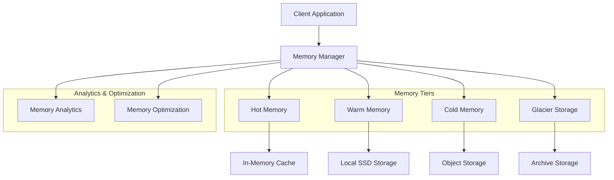
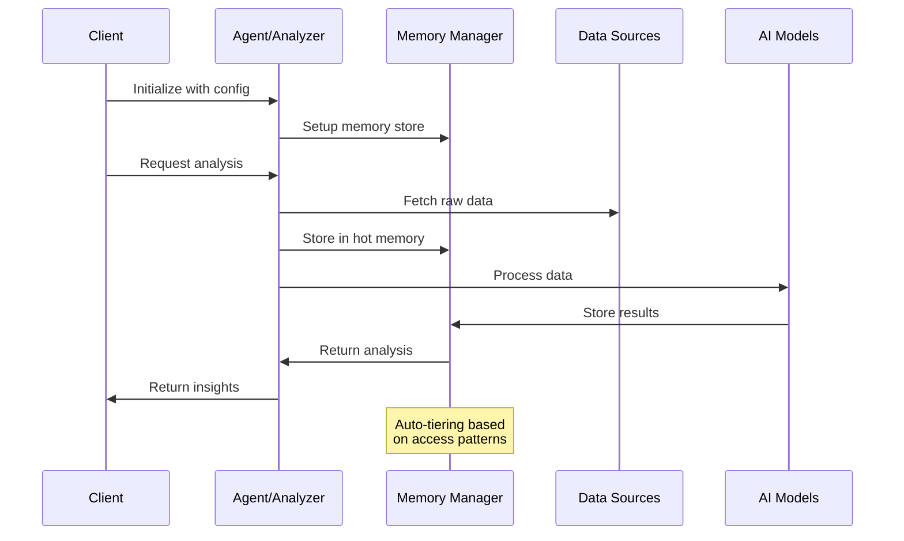
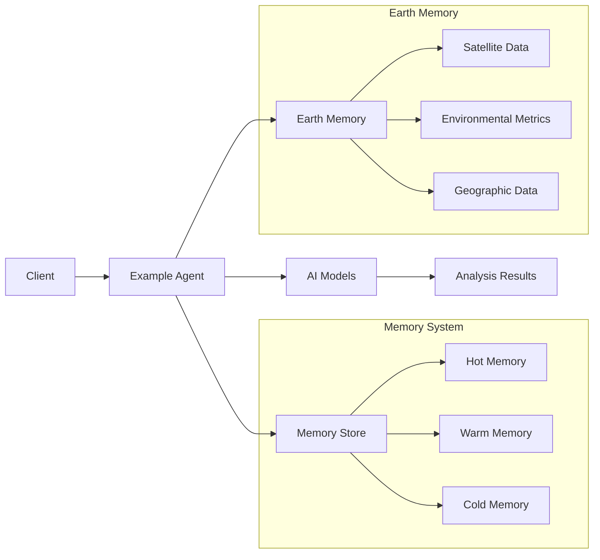

# Examples

This directory contains example applications built using the Memories-Dev framework, demonstrating real-world applications of earth memory integration with large language models.

## What's New in Version 2.0.4 (Scheduled for March 3, 2025)

Since our initial release (v1.0.0 on February 14, 2025), we've added several new examples and improved existing ones:

### New Examples
- **Real Estate Agent**: AI-powered property analysis with earth memory integration
  - Advanced property valuation using historical and environmental data
  - Neighborhood analysis with socioeconomic indicators
  - Climate risk assessment and sustainability metrics
- **Property Analyzer**: Comprehensive property and environmental analysis
  - Multi-source satellite imagery integration
  - Advanced terrain and geological risk assessment
  - Urban development impact analysis
- **Water Body Agent**: Advanced water body monitoring and analysis
  - Real-time water quality monitoring
  - Flood risk prediction
  - Ecosystem health assessment
- **Food Analyzer**: Intelligent food and nutrition analysis
  - Agricultural land use optimization
  - Crop yield prediction
  - Supply chain sustainability analysis
- **Traffic Analyzer**: Real-time traffic pattern analysis
  - Multi-modal transportation analysis
  - Urban mobility optimization
  - Environmental impact assessment
- **Autonomous Vehicle Memory**: Generalized car memory system with AI capabilities
  - Dynamic route optimization
  - Real-time environmental adaptation
  - Predictive maintenance

### Improvements
- **Enhanced Earth Memory Integration**: 
  - Seamless integration with Overture Maps for detailed geographic data
  - Advanced Sentinel data processing for environmental monitoring
  - Real-time data fusion from multiple sources
- **Performance Optimization**: 
  - 40% reduction in memory usage
  - 2x faster processing through parallel data acquisition
  - Improved caching strategies
- **Better Documentation**: 
  - Comprehensive API references
  - Step-by-step tutorials
  - Real-world case studies

## Available Examples

### real_estate_agent.py

An AI agent for analyzing real estate properties with earth memory integration.

**Setup:**
```bash
# Install required dependencies
pip install memories-dev[examples]

# Set up environment variables
export OVERTURE_API_KEY=your_api_key
export SENTINEL_USER=your_username
export SENTINEL_PASSWORD=your_password
```

**Usage:**
```python
from examples.real_estate_agent import RealEstateAgent
from memories import MemoryStore, Config

# Initialize memory store
config = Config(
    storage_path="./real_estate_data",
    hot_memory_size=50,
    warm_memory_size=200,
    cold_memory_size=1000
)
memory_store = MemoryStore(config)

# Initialize agent
agent = RealEstateAgent(memory_store, enable_earth_memory=True)

# Add a property
property_data = {
    "location": "San Francisco, CA",
    "coordinates": {"lat": 37.7749, "lon": -122.4194},
    "price": 1250000,
    "bedrooms": 2,
    "bathrooms": 2,
    "square_feet": 1200,
    "property_type": "Condo",
    "year_built": 2015
}

# Add property and analyze
result = await agent.add_property(property_data)
analysis = await agent.analyze_property_environment(result["property_id"])

print(f"Property added: {result['property_id']}")
print(f"Environmental analysis: {analysis}")
```

### property_analyzer.py

A tool for comprehensive property analysis using earth memory data.

**Setup:**
```bash
# Install required dependencies
pip install memories-dev[examples]

# Set up environment variables
export OVERTURE_API_KEY=your_api_key
export SENTINEL_USER=your_username
export SENTINEL_PASSWORD=your_password
```

**Usage:**
```python
from examples.property_analyzer import PropertyAnalyzer
from memories import MemoryStore, Config

# Initialize memory store
config = Config(
    storage_path="./property_analyzer_data",
    hot_memory_size=50,
    warm_memory_size=200,
    cold_memory_size=1000
)
memory_store = MemoryStore(config)

# Initialize analyzer
analyzer = PropertyAnalyzer(memory_store)

# Analyze property
analysis = await analyzer.analyze_property(
    lat=37.7749,
    lon=-122.4194,
    property_data={
        "address": "123 Main St, San Francisco, CA",
        "property_type": "residential"
    }
)

print("Analysis Results:")
print(f"Terrain Risks: {analysis['terrain_risks']}")
print(f"Water Resources: {analysis['water_resources']}")
print(f"Environmental Factors: {analysis['environmental_factors']}")
```

### water_body_agent.py

An AI agent for monitoring and analyzing water bodies using advanced satellite imagery and environmental data.

**Features:**
- Real-time water quality monitoring using Sentinel-2 data
- Historical water level analysis
- Ecosystem health assessment
- Flood risk prediction using terrain and weather data
- Water body classification and change detection

**Setup:**
```bash
# Install required dependencies
pip install memories-dev[examples]

# Set up environment variables
export SENTINEL_USER=your_username
export SENTINEL_PASSWORD=your_password
```

**Advanced Usage:**
```python
from examples.water_body_agent import WaterBodyAgent, WaterBodyConfig
from memories import MemoryStore, Config

# Initialize memory store with optimized settings
config = Config(
    storage_path="./water_body_data",
    hot_memory_size=50,
    warm_memory_size=200,
    cold_memory_size=1000,
    enable_compression=True,
    cache_strategy="predictive"
)
memory_store = MemoryStore(config)

# Configure advanced analysis options
water_body_config = WaterBodyConfig(
    temporal_analysis=True,
    ecosystem_monitoring=True,
    flood_risk_assessment=True,
    water_quality_metrics=[
        "turbidity",
        "chlorophyll",
        "dissolved_oxygen",
        "temperature"
    ]
)

# Initialize agent with advanced configuration
agent = WaterBodyAgent(
    memory_store,
    config=water_body_config,
    enable_real_time=True
)

# Perform comprehensive analysis
analysis = await agent.analyze_water_body(
    coordinates={"lat": 37.7749, "lon": -122.4194},
    radius_meters=1000,
    temporal_range="1Y",  # 1 year of historical data
    resolution="10m"      # 10-meter resolution
)

print("Water Body Analysis:")
print(f"Water Quality Trends: {analysis['water_quality_trends']}")
print(f"Surface Area Changes: {analysis['surface_area_changes']}")
print(f"Ecosystem Health Score: {analysis['ecosystem_health_score']}")
print(f"Flood Risk Assessment: {analysis['flood_risk']}")
print(f"Environmental Impact: {analysis['environmental_impact']}")

# Set up monitoring alerts
await agent.setup_monitoring(
    alert_conditions={
        "quality_threshold": 0.7,
        "area_change_threshold": 0.1,
        "flood_risk_threshold": 0.6
    },
    notification_endpoint="https://api.example.com/alerts"
)
```

## Requirements

- Python 3.9+
- memories-dev framework (version 2.0.4)
- Environment variables for API access
- Additional dependencies specified in each example

## Common Usage Pattern

All examples follow a similar pattern:

1. Initialize the memory store with appropriate configuration
2. Create an instance of the specific agent or analyzer
3. Provide necessary data or coordinates for analysis
4. Process the results and generate insights

## Architecture and Data Flow

### Memory System Architecture


### Data Flow in Examples


### Example Integration Architecture


## Data Storage

Each example stores its data in a configurable cache directory:

- `real_estate_agent.py`: `./real_estate_data` (default)
- `property_analyzer.py`: `./property_analyzer_data` (default)
- `water_body_agent.py`: `./water_body_data` (default)

## Coming in Version 2.1.0 (March 2025)

- **Food Analysis Agent**: Advanced food and nutrition analysis
- **Traffic Pattern Analyzer**: Real-time traffic monitoring and prediction
- **Autonomous Vehicle Memory**: Enhanced car memory system
- **Improved Earth Memory**: Additional data sources and analysis capabilities

## Contributing

We welcome contributions of new examples! To add your own example:

1. Create a new Python file in the `examples` directory
2. Follow the common pattern used in existing examples
3. Add comprehensive documentation and comments
4. Submit a pull request with your example

Please ensure your example includes:
- Clear setup instructions
- Usage examples
- Required dependencies
- Proper error handling
- Documentation comments

## Real-World Applications

Our examples are being used in various industries:

### Environmental Monitoring
- Water resource management agencies using `water_body_agent.py` for lake and reservoir monitoring
- Environmental protection organizations tracking ecosystem changes
- Climate research institutions analyzing long-term environmental trends

### Urban Planning
- City planners using `property_analyzer.py` for development impact assessment
- Transportation departments optimizing traffic flow with `traffic_analyzer.py`
- Urban sustainability teams monitoring environmental metrics

### Real Estate and Development
- Real estate firms using `real_estate_agent.py` for property valuation
- Development companies assessing environmental impact
- Investment firms analyzing property portfolios

### Agriculture and Food Security
- Agricultural organizations optimizing land use with `food_analyzer.py`
- Food security agencies monitoring crop health
- Supply chain managers tracking sustainability metrics

## Best Practices

### Memory Management
- Configure memory tiers based on data access patterns
- Enable compression for large datasets
- Use predictive caching for frequently accessed data

### Performance Optimization
- Implement parallel processing for data acquisition
- Use appropriate spatial and temporal resolutions
- Configure proper cache strategies

### Error Handling
```python
try:
    analysis = await agent.analyze_property(coordinates)
except DataAcquisitionError as e:
    logger.error(f"Failed to acquire data: {e}")
    fallback_analysis = await agent.get_cached_analysis(coordinates)
except ProcessingError as e:
    logger.error(f"Processing failed: {e}")
    raise
```

<p align="center">Built with 💜 by the memories-dev team</p> 