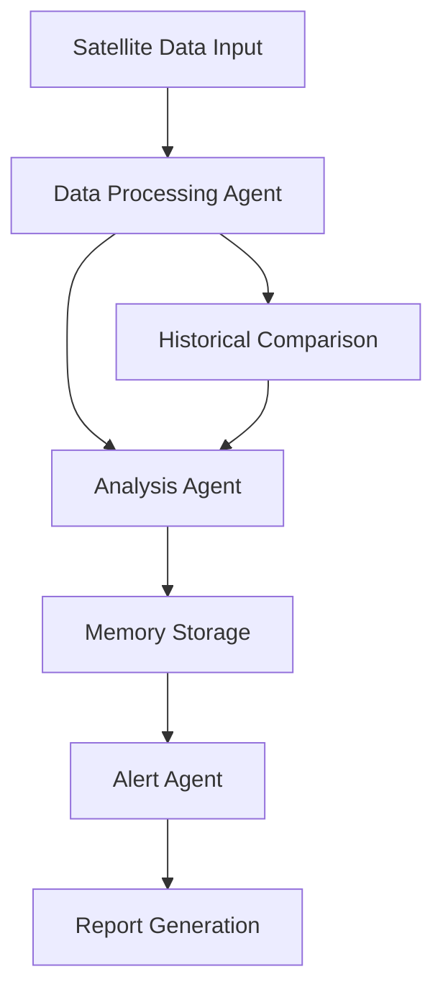
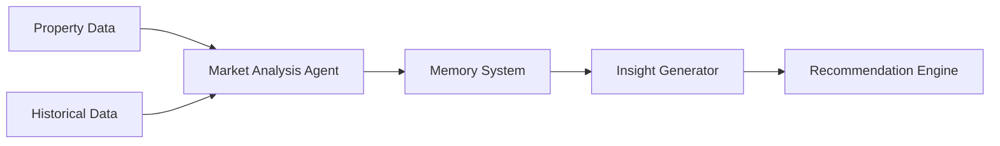
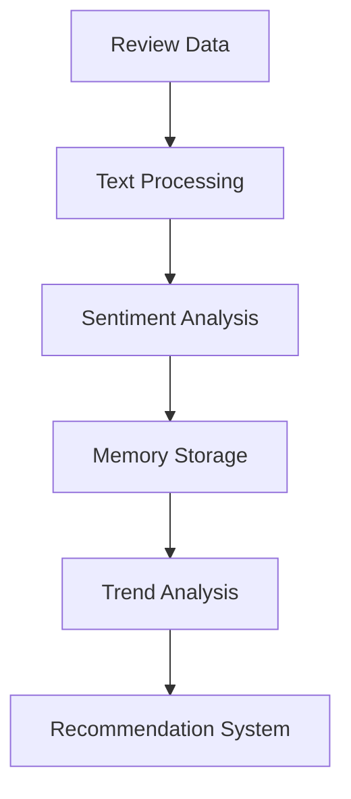
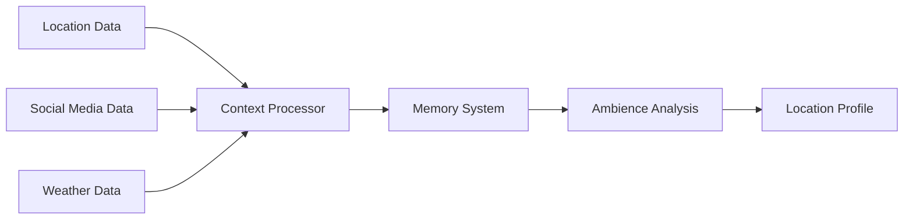

# Memories-Dev Examples

This directory contains real-world examples demonstrating the capabilities of the Memories-Dev framework. Each example showcases different aspects of the system and provides practical use cases.

## Examples Overview

1. **Global Water Bodies Monitor** (`water_bodies_monitor.py`)
   - Monitors changes in global water bodies using satellite data
   - Demonstrates long-term memory storage and temporal analysis
   - Uses multi-agent collaboration for data verification



2. **Real Estate Intelligence** (`property_analyzer.py`)
   - Analyzes property details and market trends
   - Showcases memory-based pattern recognition
   - Implements multi-source data integration



3. **Food and Restaurant Analysis** (`food_analyzer.py`)
   - Processes restaurant reviews and food trends
   - Demonstrates sentiment analysis capabilities
   - Shows temporal pattern recognition



4. **Location Ambience Analyzer** (`ambience_analyzer.py`)
   - Analyzes location characteristics and atmosphere
   - Uses multi-modal data processing
   - Implements context-aware memory storage



## Getting Started

1. Install required dependencies:
```bash
pip install -r requirements.txt
```

2. Set up your environment variables:
```bash
export MEMORIES_API_KEY=your_api_key
export OPENAI_API_KEY=your_openai_key  # If using OpenAI integration
```

3. Run any example:
```bash
python examples/water_bodies_monitor.py
```

## Example Structure

Each example follows a consistent structure:
- Configuration setup
- Agent initialization
- Memory system integration
- Data processing pipeline
- Result visualization/reporting

## Contributing

Feel free to contribute your own examples by following these guidelines:
1. Create a new Python file in the examples directory
2. Add appropriate documentation and comments
3. Include a section in this README
4. Create a pull request

## Notes

- Examples use simulated data where real-time data is not available
- API keys and sensitive data should be stored in environment variables
- Each example can be run independently
- Memory persistence is enabled by default 