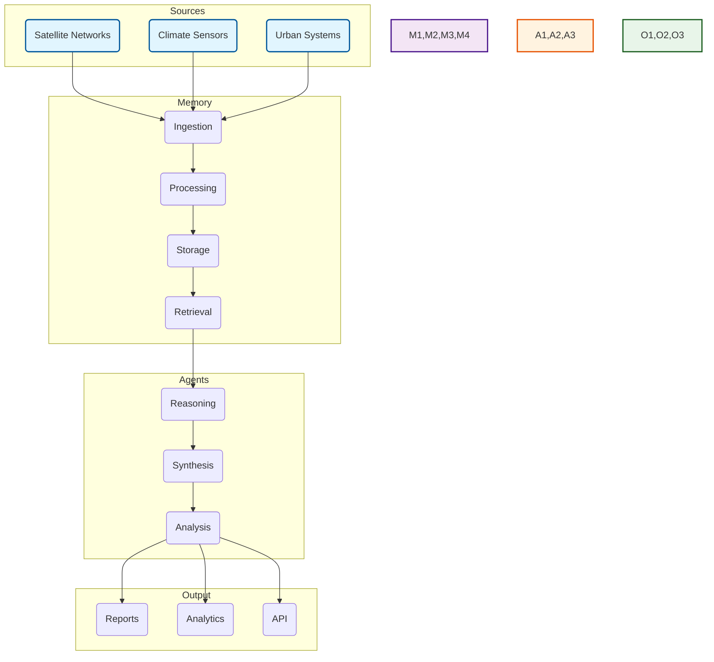

# memories.dev Technical Documentation

[](https://docs.memories.dev)
[](LICENSE)
[](https://www.python.org/downloads/)
[](https://github.com/psf/black)

## Overview

memories.dev is a high-performance infrastructure for providing real-world context to AI models during inference. It processes, indexes, and serves location-tagged intelligence ("memories") from multiple data sources including satellite imagery, climate sensors, and urban development metrics.

## Quick Start

```python
from memories_dev import Memory, Agent
from memories_dev.types import Location, TimeRange

# Initialize memory system
memory = Memory(config="default")

# Create an agent with memory capabilities
agent = Agent(
    model="gpt-4",
    memory_enabled=True,
    context_window=8192
)

# Query location-specific memories
context = memory.query(
    location=Location(lat=37.7749, lon=-122.4194),
    time_range=TimeRange(start="2024-01-01", end="2024-02-01"),
    types=["satellite", "climate", "urban"]
)

# Run analysis with memory-augmented reasoning
response = agent.analyze(
    query="Analyze urban development impact on local climate",
    context=context,
    output_format="report"
)
```

## System Architecture

### Core Components



### Directory Structure

```
memories-dev/
├── agents/                # AI Agents & Reasoning
│   ├── reasoning/        # Core reasoning engines
│   │   ├── llm.py       # LLM integration
│   │   └── chain.py     # Reasoning chains
│   ├── memory/          # Memory augmentation
│   │   ├── retrieval.py # Memory retrieval
│   │   └── context.py   # Context management
│   └── tasks/           # Task-specific agents
│       ├── analysis.py  # Analysis agents
│       └── report.py    # Report generation
├── data_acquisition/     # Data Collection
│   ├── satellite/       # Satellite data
│   │   ├── sentinel/   # Sentinel handlers
│   │   └── landsat/    # Landsat handlers
│   ├── sensors/        # Sensor networks
│   │   ├── climate/    # Climate sensors
│   │   └── urban/      # Urban sensors
│   └── streams/        # Real-time streams
│       ├── ingest/     # Stream ingestion
│       └── process/    # Stream processing
├── memories/           # Memory System
│   ├── store/         # Memory storage
│   │   ├── vector.py  # Vector store
│   │   └── index.py   # Memory indexing
│   ├── formation/     # Memory formation
│   │   ├── create.py  # Memory creation
│   │   └── update.py  # Memory updates
│   └── query/         # Memory querying
│       ├── spatial.py # Spatial queries
│       └── temporal.py# Temporal queries
├── models/            # AI Models
│   ├── embedding/    # Embedding models
│   ├── vision/       # Vision models
│   └── fusion/       # Multi-modal fusion
├── scripts/          # Utility Scripts
│   ├── setup/       # Setup scripts
│   ├── deploy/      # Deployment scripts
│   └── maintenance/ # Maintenance scripts
├── synthesis/        # Memory Synthesis
│   ├── fusion/      # Data fusion
│   │   ├── spatial.py # Spatial fusion
│   │   └── temporal.py# Temporal fusion
│   ├── analysis/    # Pattern analysis
│   │   ├── trends.py  # Trend analysis
│   │   └── patterns.py# Pattern detection
│   └── generation/  # Synthetic generation
└── utils/           # Utilities
    ├── config/      # Configuration
    ├── logging/     # Logging utilities
    └── validation/  # Data validation
```

## Core Features

### Memory System
- **Formation**: Dynamic memory creation and management
- **Storage**: Multi-tier caching with vector store
- **Retrieval**: Context-aware memory access
- **Synthesis**: Pattern recognition and fusion

### Agent System
- **Reasoning**: Memory-augmented LLM reasoning
- **Analysis**: Pattern detection and trend analysis
- **Reporting**: Automated insight generation

### Data Sources
- **Satellite**: Sentinel-1/2, Landsat
- **Climate**: Temperature, precipitation, air quality
- **Urban**: Infrastructure, development, population

## API Examples

### Memory Operations

```python
from memories_dev import Memory
from memories_dev.types import DataSource, MemoryConfig

# Initialize with custom configuration
memory = Memory(
    config=MemoryConfig(
        vector_store="milvus",
        cache_size="32GB",
        index_type="hnsw"
    )
)

# Create memory from data source
source = DataSource(
    type="satellite",
    provider="sentinel-2",
    bands=["B02", "B03", "B04", "B08"]
)

# Ingest and process data
memory_id = memory.create(
    source=source,
    location=Location(lat=37.7749, lon=-122.4194),
    time_range=TimeRange(start="2024-01-01", end="2024-02-01")
)

# Query with spatial-temporal constraints
results = memory.query(
    memory_id=memory_id,
    radius="10km",
    time_window="1M",
    resolution="10m"
)
```

### Agent Operations

```python
from memories_dev import Agent
from memories_dev.types import AgentConfig, Task

# Initialize analysis agent
agent = Agent(
    config=AgentConfig(
        model="gpt-4",
        memory_enabled=True,
        context_window=8192
    )
)

# Define analysis task
task = Task(
    type="urban_analysis",
    parameters={
        "focus": "development",
        "metrics": ["building_density", "green_space"],
        "temporal_resolution": "monthly"
    }
)

# Run analysis with memory context
report = agent.execute(
    task=task,
    context=memory_context,
    format="markdown"
)
```

## Development

### Environment Setup

```bash
# Clone repository
git clone https://github.com/memories-dev/memories.dev.git
cd memories.dev

# Create virtual environment
python -m venv venv
source venv/bin/activate  # Linux/Mac
venv\Scripts\activate     # Windows

# Install dependencies
pip install -e ".[dev,test,docs]"

# Setup pre-commit hooks
pre-commit install
```

### Testing

```bash
# Run test suite
pytest

# Test specific components
pytest tests/memories/
pytest tests/agents/
pytest tests/synthesis/

# Run with coverage
pytest --cov=memories_dev --cov-report=html
```

## Deployment

### Development Server

```bash
# Start development server
memories-dev serve --dev --port 8000 --reload
```

### Production Deployment

```bash
# Deploy with production settings
memories-dev serve \
    --port 8000 \
    --workers 4 \
    --memory-limit 32GB \
    --vector-store milvus \
    --cache-strategy distributed
```

## Security

### Data Protection
- End-to-end encryption
- Granular access control
- Audit logging
- Privacy-preserving computation

### API Security
- JWT authentication
- Rate limiting
- Input validation
- Security headers

## Contributing

1. Fork the repository
2. Create a feature branch (`git checkout -b feature/amazing-feature`)
3. Make changes and add tests
4. Run tests (`pytest`)
5. Commit changes (`git commit -m 'Add amazing feature'`)
6. Push to branch (`git push origin feature/amazing-feature`)
7. Open a Pull Request

## License

Apache License 2.0 - See [LICENSE](LICENSE)

## Support

- Documentation: [docs.memories.dev](https://docs.memories.dev)
- Issues: [GitHub Issues](https://github.com/memories-dev/memories.dev/issues)
- Discord: [Join Community](https://discord.gg/memories-dev)
- Email: support@memories.dev
