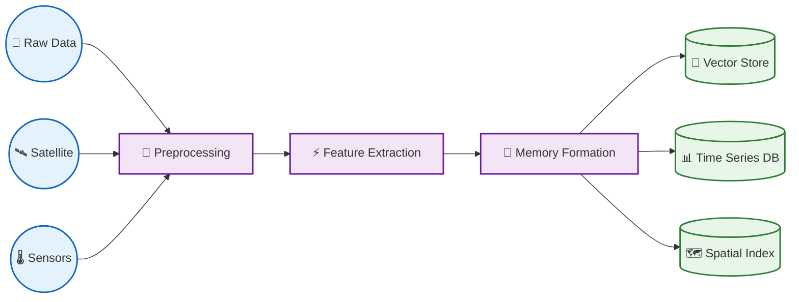
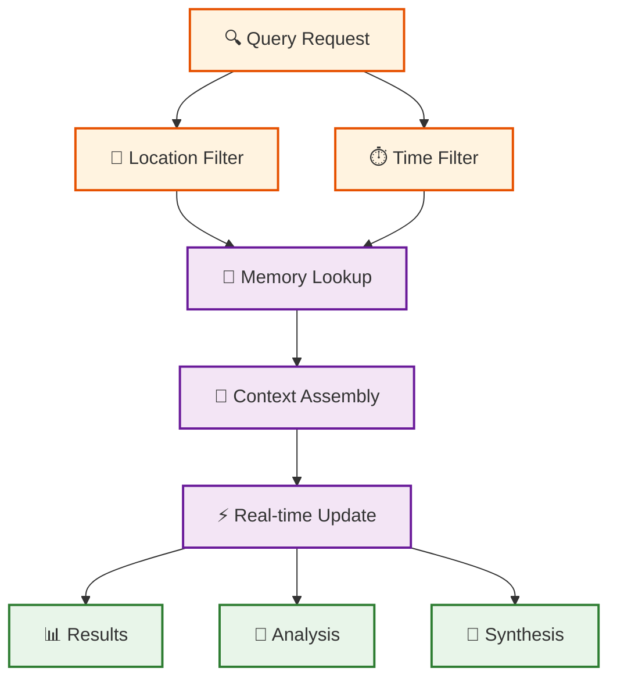
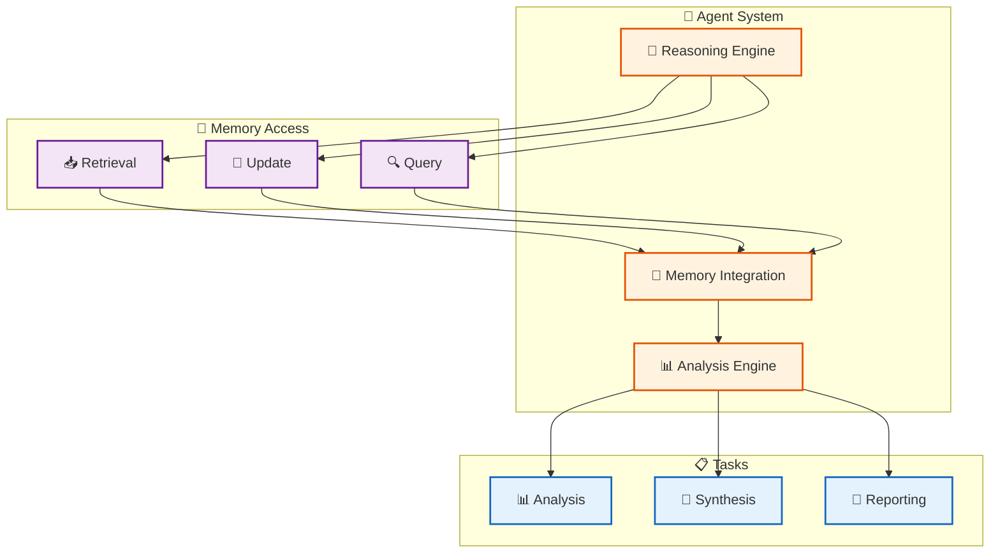
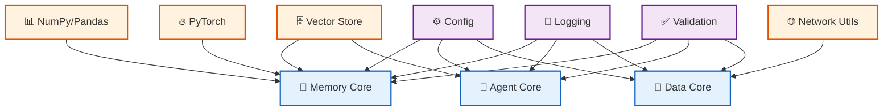

# Source Code Documentation

## 📁 Directory Structure

```
src/
├── agents/                 # 🤖 Agent System
│   ├── core/              # Core agent functionality
│   │   ├── base.py        # Base agent classes
│   │   └── registry.py    # Agent registry
│   ├── memory/            # Memory integration
│   │   ├── context.py     # Context management
│   │   └── retrieval.py   # Memory retrieval
│   └── specialized/       # Specialized agents
│       ├── analysis.py    # Analysis agents
│       └── synthesis.py   # Synthesis agents
│
├── data_acquisition/      # 📡 Data Collection
│   ├── satellite/         # Satellite data handlers
│   │   ├── sentinel/     # Sentinel-1/2
│   │   └── landsat/      # Landsat 7/8
│   ├── sensors/          # Sensor networks
│   │   ├── climate/      # Climate sensors
│   │   └── urban/        # Urban sensors
│   └── streams/          # Real-time streams
│       ├── ingest.py     # Stream ingestion
│       └── process.py    # Stream processing
│
├── memories/             # 🧠 Memory System
│   ├── store/           # Storage backend
│   │   ├── vector.py    # Vector store
│   │   └── index.py     # Indexing system
│   ├── formation/       # Memory creation
│   │   ├── create.py    # Memory formation
│   │   └── update.py    # Memory updates
│   └── query/           # Query system
│       ├── spatial.py   # Spatial queries
│       └── temporal.py  # Temporal queries
│
├── models/              # 🔮 AI Models
│   ├── embedding/      # Embedding models
│   │   ├── text.py    # Text embeddings
│   │   └── vision.py  # Vision embeddings
│   ├── reasoning/     # Reasoning models
│   │   ├── llm.py    # Language models
│   │   └── chain.py  # Reasoning chains
│   └── fusion/       # Multi-modal fusion
│       └── combine.py # Modality fusion
│
├── synthesis/         # 🔄 Memory Synthesis
│   ├── fusion/       # Data fusion
│   │   ├── spatial.py  # Spatial fusion
│   │   └── temporal.py # Temporal fusion
│   └── generation/   # Synthetic data
│       ├── augment.py  # Data augmentation
│       └── create.py   # Synthetic creation
│
└── utils/            # 🛠️ Utilities
    ├── config/       # Configuration
    ├── logging/      # Logging system
    └── validation/   # Data validation
```

## 🔄 Workflows

### Memory Formation Pipeline



### Query Pipeline



### Agent System



## 🔑 Key Components

### 🤖 Agent System
- **Base Agent**: Core agent functionality and interfaces
- **Memory Integration**: Memory access and context management
- **Specialized Agents**: Task-specific agent implementations

### 📡 Data Acquisition
- **Satellite Data**: Handlers for various satellite data sources
- **Sensor Networks**: Climate and urban sensor data collection
- **Stream Processing**: Real-time data stream handling

### 🧠 Memory System
- **Storage**: Vector store and indexing systems
- **Formation**: Memory creation and update mechanisms
- **Query**: Spatial and temporal query capabilities

### 🔮 Models
- **Embeddings**: Text and vision embedding models
- **Reasoning**: LLM integration and reasoning chains
- **Fusion**: Multi-modal data fusion capabilities

### 🔄 Synthesis
- **Data Fusion**: Spatial and temporal data fusion
- **Generation**: Synthetic data creation and augmentation

### 🛠️ Utilities
- **Configuration**: System configuration management
- **Logging**: Comprehensive logging system
- **Validation**: Data validation utilities

## 📚 Module Dependencies



## 🚀 Getting Started

For development setup and usage examples, please refer to the main [README.md](../README.md) in the project root.
