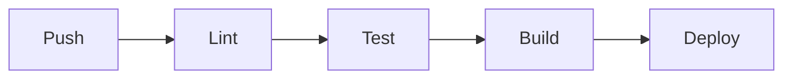
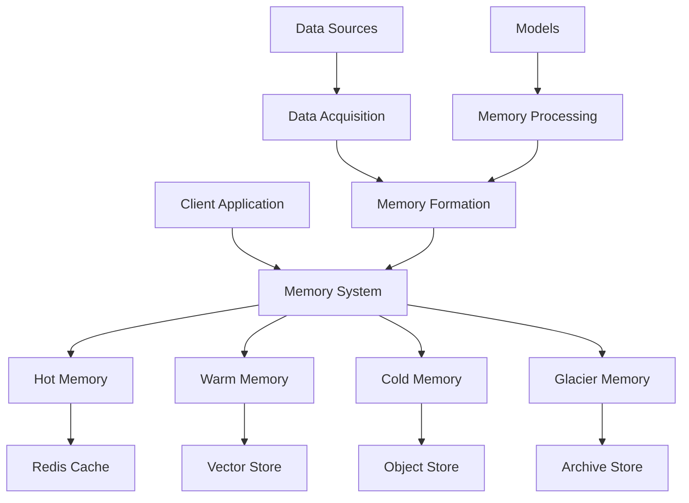
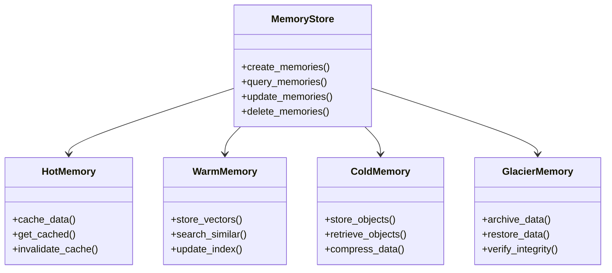
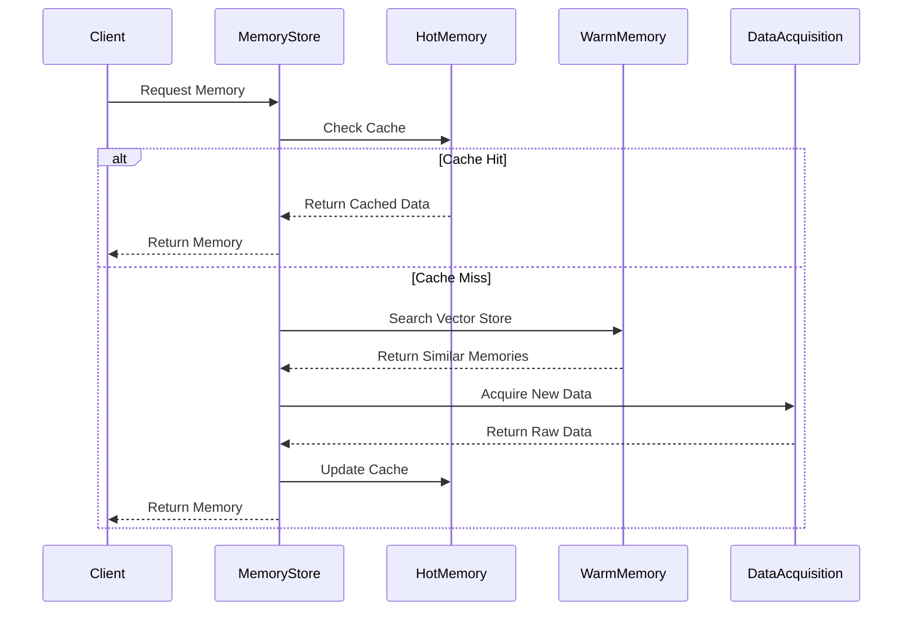

# 🧠 memories.dev

[](https://www.python.org/downloads/)
[](https://opensource.org/licenses/Apache-2.0)
[](https://github.com/psf/black)
[](https://github.com/Vortx-AI/memories-dev/actions/workflows/tests.yml)

> Collective AGI memory - v1.1.2 (February 16, 2024)

## 🌟 Overview

memories.dev is a groundbreaking framework for building and managing collective AGI memory systems. It provides a robust architecture for memory formation, retrieval, and synthesis across multiple modalities, enabling AI models to maintain and utilize contextual understanding across interactions.

### 🎯 Key Goals
- Enable persistent memory for AI systems
- Provide context-aware intelligence
- Support multi-modal memory integration
- Ensure scalable and efficient memory operations
- Maintain privacy and security in memory access

## 🚀 Quick Start

```python
from memories_dev import MemorySystem
from memories_dev.models import ModelRegistry

# Initialize the memory system
memory_system = MemorySystem(
    store_type="vector",  # Options: "vector", "graph", "hybrid"
    vector_store="milvus",  # Coming in v1.1: Support for multiple vector stores
    embedding_model="text-embedding-3-small"
)


# Store a memory
memory_id = memory_system.store(
    content="The city's air quality improved by 15% after implementing new policies.",
    metadata={
        "location": {"lat": 37.7749, "lon": -122.4194},
        "timestamp": "2024-03-15T10:30:00Z",
        "source": "environmental_sensor"
    }
)

# Query memories with context
relevant_memories = memory_system.query(
    query="What were the environmental changes in San Francisco?",
    location_radius_km=10,
    time_range=("2024-01-01", "2024-03-15")
)


```

## 🏗️ Installation

### Current Release (v1.0.0)
```bash
# Basic installation
pip install git+https://github.com/Vortx-AI/memories-dev.git

# Development installation
git clone https://github.com/Vortx-AI/memories-dev.git
cd memories-dev
pip install -e ".[dev]"
```

### Coming in v1.1.0
```bash
# Installation with all features
pip install memories-dev[all]

# GPU-optimized installation
pip install memories-dev[gpu]
```

## 🔧 System Requirements

### Minimum (Development)
- Python 3.9+
- 16GB RAM
- 4+ CPU cores
- 20GB storage
- Docker & Docker Compose (for local development)

### Production (Recommended)
- 32GB+ RAM
- 8+ CPU cores
- NVIDIA GPU with 8GB+ VRAM
- 100GB+ SSD storage
- Kubernetes cluster for distributed deployment

## 📊 Monitoring & Observability

### Available Now (v1.0.0)
- Basic logging system with structured output
- Memory operation metrics
- Performance tracking for core operations
- Health check endpoints

### Coming in v1.1.0
- 📈 Grafana dashboards for memory metrics
- 🔍 Prometheus integration
- 🔄 Real-time memory operation monitoring
- 📊 Advanced performance analytics
- 🚨 Automated alerting system

## 🧪 Development Features

### Available Now
- Memory store implementations
- Core memory operations
- Unit test framework
- Development environment setup

### Coming Soon (v1.1.0)
- Enhanced memory compression
- Advanced caching system
- Distributed memory operations
- Memory garbage collection
- Advanced security features

## 📁 Project Structure

```
memories-dev/
├── examples/              # Example implementations
│   ├── basic/            # Basic usage examples
│   ├── advanced/         # Advanced implementations
│   └── notebooks/        # Jupyter notebooks
│
├── memories_dev/         # Main package
│   ├── models/           # Models
│   │   ├── core/       # Core functionality
│   │   │   ├── base.py     # Base  classes
│   │   │   └── registry.py #  registry
│   │   ├── memory/     # Memory integration
│   │   │   ├── context.py  # Context management
│   │   │   └── retrieval.py# Memory retrieval
│   │   └── specialized/# Specialized 
│   │       ├── analysis.py # Analysis 
│   │       └── synthesis.py# Synthesis 
│   │
│   ├── data_acquisition/# Data Collection
│   │   ├── satellite/   # Satellite data handlers
│   │   │   ├── sentinel/# Sentinel-1/2
│   │   │   └── landsat/ # Landsat 7/8
│   │   ├── sensors/    # Sensor networks
│   │   │   ├── climate/# Climate sensors
│   │   │   └── urban/  # Urban sensors
│   │   └── streams/    # Real-time streams
│   │       ├── ingest.py # Stream ingestion
│   │       └── process.py# Stream processing
│   │
│   ├── memories/       # Memory System
│   │   ├── store/     # Storage backend
│   │   │   ├── vector.py# Vector store
│   │   │   └── index.py # Indexing system
│   │   ├── formation/ # Memory creation
│   │   │   ├── create.py# Memory formation
│   │   │   └── update.py# Memory updates
│   │   └── query/     # Query system
│   │       ├── spatial.py # Spatial queries
│   │       └── temporal.py# Temporal queries
│   │
│   ├── models/        # AI Models
│   │   ├── embedding/ # Embedding models
│   │   │   ├── text.py  # Text embeddings
│   │   │   └── vision.py# Vision embeddings
│   │   ├── reasoning/# Reasoning models
│   │   │   ├── llm.py   # Language models
│   │   │   └── chain.py # Reasoning chains
│   │   └── fusion/   # Multi-modal fusion
│   │       └── combine.py# Modality fusion
│   │
│   ├── synthesis/    # Memory Synthesis
│   │   ├── fusion/  # Data fusion
│   │   │   ├── spatial.py # Spatial fusion
│   │   │   └── temporal.py# Temporal fusion
│   │   └── generation/# Synthetic data
│   │       ├── augment.py # Data augmentation
│   │       └── create.py  # Synthetic creation
│   │
│   └── utils/       # Utilities
│       ├── config/  # Configuration
│       ├── logging/ # Logging system
│       └── validation/# Data validation
│
├── tests/           # Test Suite
│   ├── unit/       # Unit tests
│   └── integration/# Integration tests
│
└── docs/           # Documentation
    ├── api/        # API documentation
    └── guides/     # User guides
```

## 🧩 Core Components Explained

### 1. 🤖 Agent System
The agent system is the intelligence layer that orchestrates memory operations:

```python
from memories_dev.agents.specialized import AnalysisAgent

# Create an analysis agent
agent = AnalysisAgent(
    capabilities=["spatial", "temporal", "pattern"],
    memory_access="read_write"
)

# Execute analysis
results = agent.analyze(
    data_sources=["satellite", "sensors"],
    time_range=("2024-01", "2024-03")
)
```

### 2. 📡 Data Acquisition
Handles multi-modal data ingestion:

```python
from memories_dev.data_acquisition.satellite import SentinelCollector
from memories_dev.data_acquisition.sensors import ClimateNetwork

# Initialize collectors
satellite = SentinelCollector(
    bands=["B02", "B03", "B04", "B08"]
)

climate = ClimateNetwork(
    metrics=["temperature", "humidity", "air_quality"]
)

# Collect data
data = {
    "satellite": satellite.collect(location=(37.7749, -122.4194)),
    "climate": climate.get_readings(timeframe="1d")
}
```

### 3. 🧠 Memory Formation
Memory creation and storage:

```python
from memories_dev.memories.formation import MemoryCreator
from memories_dev.memories.store import VectorStore

# Initialize memory system
store = VectorStore(dimension=1536)
creator = MemoryCreator(store=store)

# Create memory
memory = creator.create(
    content=data,
    metadata={
        "source": "environmental",
        "confidence": 0.95
    }
)
```

## 🎯 Features (v1.0.0)

### Core Capabilities
- 🔄 Real-time memory formation and updates
- 🔍 Advanced spatial and temporal querying
- 🤝 Multi-agent collaboration
- 🎯 Context-aware memory retrieval
- 🔗 Cross-modal memory linking

### Technical Features
- ⚡ High-performance vector storage
- 🔐 Secure memory management
- 📊 Advanced data fusion algorithms
- 🎨 Multi-modal data support
- 🔄 Real-time stream processing

## 🚀 Roadmap

### Coming in v1.1.0
- Enhanced memory compression
- Improved cross-modal reasoning
- Advanced context understanding

### Future Horizons
- Distributed memory networks
- Quantum-inspired memory storage
- Advanced consciousness simulation

## 🛠️ Development

### Prerequisites
- Python 3.8+
- CUDA-compatible GPU (recommended)
- Vector store backend (Redis/Milvus/Pinecone)
- Docker & Docker Compose
- Make (optional, for using Makefile commands)

### Environment Setup

1. **Clone and Setup**
```bash
# Clone the repository
git clone https://github.com/yourusername/memories.dev.git
cd memories.dev

# Create virtual environment
python -m venv venv
source venv/bin/activate  # On Windows: .\venv\Scripts\activate

# Install dependencies
pip install -r requirements.txt
pip install -r requirements-dev.txt  # Development dependencies
```

2. **Environment Variables**
```bash
# Copy example environment file
cp .env.example .env

# Edit .env with your configurations
nano .env
```

3. **Development Database**
```bash
# Start development services
docker-compose up -d
```

### Development Workflow

#### 1. Code Style
We use `black` for code formatting and `flake8` for linting:
```bash
# Format code
make format

# Run linting
make lint
```

#### 2. Testing
```bash
# Run all tests
make test

# Run specific test file
pytest tests/test_memories/test_store.py

# Run with coverage
make coverage
```

#### 3. Pre-commit Hooks
```bash
# Install pre-commit hooks
pre-commit install

# Run hooks manually
pre-commit run --all-files
```

### 🐳 Docker Development

```bash
# Build development image
docker build -t memories-dev -f docker/Dockerfile.dev .

# Run development container
docker run -it --gpus all -v $(pwd):/app memories-dev
```

### 📊 Monitoring & Debugging

1. **Logging**
```python
# In your code
from memories.utils.logging import get_logger

logger = get_logger(__name__)
logger.info("Memory operation completed")
```

2. **Performance Monitoring**
- Access metrics dashboard: `http://localhost:8080/metrics`
- Prometheus integration available
- Grafana dashboards in `./monitoring`

### 🔄 Common Workflows

#### Adding a New Feature
1. Create feature branch: `git checkout -b feature/your-feature`
2. Implement changes
3. Add tests in `tests/`
4. Update documentation
5. Run test suite: `make test`
6. Create pull request

#### Updating Dependencies
1. Update `requirements.in` or `requirements-dev.in`
2. Compile requirements: `make requirements`
3. Test changes: `make test`
4. Commit changes

## 🚀 CI/CD Pipeline



### Automated Checks
- Code formatting (black)
- Type checking (mypy)
- Unit tests (pytest)
- Integration tests
- Security scanning
- Performance benchmarks

### Deployment Environments
- **Dev**: Automatic deployment on main branch
- **Staging**: Manual trigger from release branches
- **Production**: Tagged releases only

## 📚 Documentation

### Building Docs Locally
```bash
# Install documentation dependencies
pip install -r docs/requirements.txt

# Build documentation
cd docs
make html

# Serve documentation
python -m http.server -d _build/html
```

### API Documentation
- [API Reference](docs/api.md)
- [Architecture Guide](docs/architecture.md)
- [Development Guide](docs/development.md)
- [Deployment Guide](docs/deployment.md)
- [Contributing Guide](CONTRIBUTING.md)

### Example Notebooks
Find example notebooks in `notebooks/`:
- 🔰 Quick Start
- 🧠 Memory Operations
- 🤖 Agent Integration
- 📊 Data Visualization

## 🎓 Developer Resources

### Tutorials & Guides
- [Getting Started Guide](docs/getting_started.md)
- [Memory System Architecture](docs/architecture.md)
- [Agent Development Guide](docs/agents.md)
- [Custom Memory Store Integration](docs/custom_stores.md)

### Example Use Cases
1. **Persistent Context in Conversations**
   ```python
   # Example of maintaining context across conversations
   conversation = memory_system.create_conversation()
   conversation.add_memory("User preference: Dark mode")
   conversation.add_memory("Language: Python")
   
   # Later in the conversation
   context = conversation.get_relevant_context("IDE settings")
   ```

2. **Spatial Memory Analysis**
   ```python
   # Analyzing patterns in spatial memories
   spatial_analysis = memory_system.analyze_spatial(
       location=(37.7749, -122.4194),
       radius_km=5,
       time_range=("2024-01-01", "2024-03-15"),
       analysis_type="pattern_recognition"
   )
   ```

### Best Practices
- Always use context managers for memory operations
- Implement proper error handling
- Use batch operations for multiple memories
- Regularly clean up unused memories
- Monitor memory usage and performance

## 🤝 Community & Support

- [Discord Community](https://discord.gg/memoriesdev)
- [GitHub Discussions](https://github.com/Vortx-AI/memories-dev/discussions)
- [Documentation](https://memoriesdev.readthedocs.io/)
- [Blog](https://memoriesdev.medium.com)

## 🤝 Contributing

We welcome contributions! Please see our [Contributing Guide](CONTRIBUTING.md) for details.

### Getting Started
1. Fork the repository
2. Create your feature branch
3. Commit your changes
4. Push to the branch
5. Create a Pull Request

### Code Review Process
1. Automated checks must pass
2. Requires one approved review
3. Must maintain test coverage
4. Documentation updates required

## 📜 Version History

### v1.0.1 (February 15, 2025)
- Implemented query context agent for improved memory retrieval
- Reorganized project structure (memories-dev → memories_dev)
- Enhanced code organization and cleanup
- Improved documentation and README structure

### v1.0.0 (Initial Release, February 14, 2025)
- Initial stable release
- Core memory system implementation
- Basic agent framework
- Multi-modal data support

### v0.9.0 (Beta)
- Feature-complete beta release
- Performance optimizations
- API stabilization


## 🔌 Integration Examples

### 1. Real-time Environmental Monitoring
```python
from memories_dev import MemorySystem
from memories_dev.data_acquisition import StreamCollector
from memories_dev.synthesis import RealTimeSynthesis

# Setup real-time monitoring
stream = StreamCollector(
    sources=["air_quality", "traffic", "noise"],
    buffer_size="1h",
    sampling_rate="1m"
)

# Process and store real-time data
@stream.on_data
async def process_environmental_data(data):
    # Form memory from real-time data
    memory = await memory_system.store_streaming(
        data,
        retention_policy="24h",
        importance_threshold=0.7
    )
    
    # Trigger real-time synthesis
    insights = await RealTimeSynthesis.analyze(
        memory,
        context_window="6h"
    )
```

### 2. Multi-modal Memory Fusion
```python
from memories_dev.fusion import ModalityFusion
from memories_dev.models import MultiModalEncoder

# Initialize fusion system
fusion = ModalityFusion(
    modalities=["text", "vision", "sensor"],
    fusion_strategy="hierarchical",
    alignment="temporal"
)

# Fuse different memory types
fused_memory = fusion.combine(
    memories={
        "text": text_memory,
        "vision": image_memory,
        "sensor": sensor_data
    },
    weights={
        "text": 0.4,
        "vision": 0.4,
        "sensor": 0.2
    }
)
```

# memories Core Package

## Architecture Overview



## Component Structure



## Package Structure

```
memories/
├── agents/              # Agent System
│   ├── agent_coder.py   # Code generation agent
│   ├── agent_context.py # Context understanding
│   └── agent.py        # Base agent class
│
├── core/               # Core Memory System
│   ├── memory.py      # Main memory interface
│   ├── hot.py         # Hot memory implementation
│   ├── warm.py        # Warm memory implementation
│   ├── cold.py        # Cold memory implementation
│   └── glacier.py     # Glacier memory implementation
│
├── data_acquisition/   # Data Collection
│   ├── satellite/     # Satellite data handlers
│   ├── sensors/       # Sensor data handlers
│   └── streams/       # Real-time streams
│
├── models/            # AI Models
│   ├── load_model.py  # Model loading utilities
│   └── config/       # Model configurations
│
├── synthetic/         # Synthetic Data Generation
│   ├── generator.py   # Data generation
│   └── augment.py    # Data augmentation
│
└── utils/            # Utilities
    ├── processors.py # Data processors
    └── validators.py # Data validators
```

## Memory Tiers

### Hot Memory
- In-memory cache using Redis
- Fastest access times
- Stores frequently accessed data
- Automatic cache invalidation

### Warm Memory
- Vector store for similarity search
- Fast retrieval of related memories
- Efficient indexing and updates
- Supports semantic search

### Cold Memory
- Object storage for raw data
- Compressed storage format
- Batch processing support
- Cost-effective storage

### Glacier Memory
- Long-term archival storage
- High durability guarantee
- Infrequent access pattern
- Data integrity verification

## Data Flow



## Usage Examples

### Basic Memory Operations
```python
from memories.core.memory import MemoryStore
from memories.models.load_model import LoadModel

# Initialize
store = MemoryStore()
model = LoadModel(use_gpu=True)

# Create memories
memories = store.create_memories(
    model=model,
    location=(37.7749, -122.4194),
    time_range=("2024-01-01", "2024-02-01")
)

# Query memories
results = store.query_memories(
    query="urban development",
    location_radius_km=10
)
```

### Advanced Features
```python
from memories.synthetic import generate_synthetic
from memories.agents import Agent

# Generate synthetic data
synthetic = generate_synthetic(
    base_location=(37.7749, -122.4194),
    scenario="urban_development",
    time_steps=10
)

# Use agent for analysis
agent = Agent(
    query="Analyze development patterns",
    context_memories=memories,
    synthetic_data=synthetic
)

insights = agent.analyze()
```

## Performance Considerations

1. **Memory Tier Selection**
   - Hot memory: < 1ms access time
   - Warm memory: < 100ms access time
   - Cold memory: < 1s access time
   - Glacier memory: Minutes to hours

2. **Resource Usage**
   - Redis cache: 1-10GB RAM
   - Vector store: 10-100GB disk
   - Object store: 100GB-10TB disk
   - Archive store: 1TB+ disk

3. **Scaling Factors**
   - Number of memories
   - Memory size
   - Query complexity
   - Update frequency

## Contributing

See the main [CONTRIBUTING.md](../CONTRIBUTING.md) for guidelines on contributing to this package.

<p align="center">Built with 💜 by the memories.dev team</p>

<p align="center">
<a href="https://discord.com/invite/7qAFEekp">Discord</a> •
</p>
