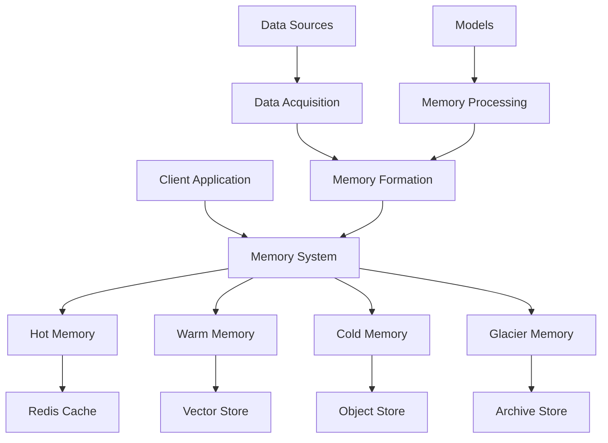
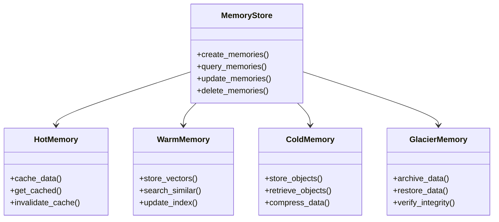
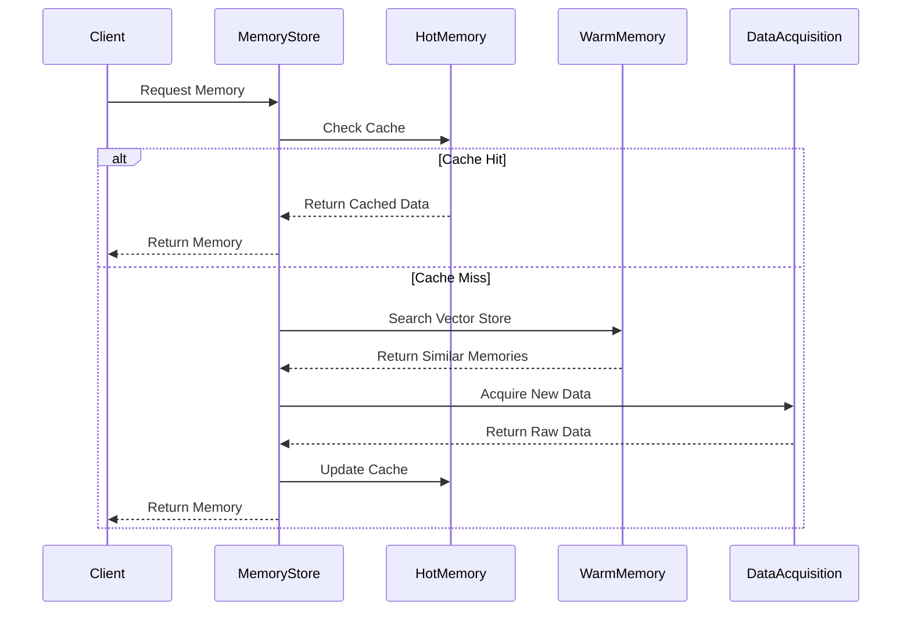

# memories Core Package

## Architecture Overview



## Component Structure



## Package Structure

```
memories/
├── agents/              # Agent System
│   ├── agent_coder.py   # Code generation agent
│   ├── agent_context.py # Context understanding
│   └── agent.py        # Base agent class
│
├── core/               # Core Memory System
│   ├── memory.py      # Main memory interface
│   ├── hot.py         # Hot memory implementation
│   ├── warm.py        # Warm memory implementation
│   ├── cold.py        # Cold memory implementation
│   └── glacier.py     # Glacier memory implementation
│
├── data_acquisition/   # Data Collection
│   ├── satellite/     # Satellite data handlers
│   ├── sensors/       # Sensor data handlers
│   └── streams/       # Real-time streams
│
├── models/            # AI Models
│   ├── load_model.py  # Model loading utilities
│   └── config/       # Model configurations
│
├── synthetic/         # Synthetic Data Generation
│   ├── generator.py   # Data generation
│   └── augment.py    # Data augmentation
│
└── utils/            # Utilities
    ├── processors.py # Data processors
    └── validators.py # Data validators
```

## Memory Tiers

### Hot Memory
- In-memory cache using Redis
- Fastest access times
- Stores frequently accessed data
- Automatic cache invalidation

### Warm Memory
- Vector store for similarity search
- Fast retrieval of related memories
- Efficient indexing and updates
- Supports semantic search

### Cold Memory
- Object storage for raw data
- Compressed storage format
- Batch processing support
- Cost-effective storage

### Glacier Memory
- Long-term archival storage
- High durability guarantee
- Infrequent access pattern
- Data integrity verification

## Data Flow



## Usage Examples

### Basic Memory Operations
```python
from memories.core.memory import MemoryStore
from memories.models.load_model import LoadModel

# Initialize
store = MemoryStore()
model = LoadModel(use_gpu=True)

# Create memories
memories = store.create_memories(
    model=model,
    location=(37.7749, -122.4194),
    time_range=("2024-01-01", "2024-02-01")
)

# Query memories
results = store.query_memories(
    query="urban development",
    location_radius_km=10
)
```

### Advanced Features
```python
from memories.synthetic import generate_synthetic
from memories.agents import Agent

# Generate synthetic data
synthetic = generate_synthetic(
    base_location=(37.7749, -122.4194),
    scenario="urban_development",
    time_steps=10
)

# Use agent for analysis
agent = Agent(
    query="Analyze development patterns",
    context_memories=memories,
    synthetic_data=synthetic
)

insights = agent.analyze()
```

## Performance Considerations

1. **Memory Tier Selection**
   - Hot memory: < 1ms access time
   - Warm memory: < 100ms access time
   - Cold memory: < 1s access time
   - Glacier memory: Minutes to hours

2. **Resource Usage**
   - Redis cache: 1-10GB RAM
   - Vector store: 10-100GB disk
   - Object store: 100GB-10TB disk
   - Archive store: 1TB+ disk

3. **Scaling Factors**
   - Number of memories
   - Memory size
   - Query complexity
   - Update frequency

## Contributing

See the main [CONTRIBUTING.md](../CONTRIBUTING.md) for guidelines on contributing to this package. 